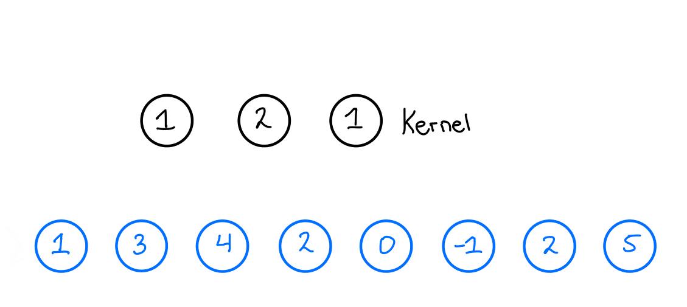

Temporal Convolutional Networks (TCN) which are a variaton of Convolutional Neural Networks (CNN), recently have been used by deep learning practitioners to solve time series tasks with promising and successful outcomes as seen here [CITE]. I for one have employed TCNs for detecting Arythmia in ECG signals with great success. In this short post I want to explain how these networks work, how they differ from normal CNNs and take a look into the computational workload.

For sake of illusration I will explain all of these concepts here in 1D, but they also work in higher dimensions. First let us look at normal a CNN, let's assume that we have one layer, which has a kernel size of 3 and 1 filter. And let's assume that we have a input time series that looks like the one here below:

When we then want to apply the 1D convolution to this input time series we do the following: We take our kernel size, which is 3, and slide it over the input time series to produce a output time series. Now how does this actually look like? Let's look at the first output of the output time series and see how that is produced,

We then slide the kernel over the whole input time series and get the following output:

Now first thing we notice is that the output time series is not the same length as the input time series. This is because we do not do any padding, and we can calculate the output length by the following formula:
$$
T_{out} = T_{in} - (k-1)
$$
Where $k$ is the kernel size. TCNs work in a very similar way, with one addidional factor which is called dilation. Dilation is a way to increase the receptive field size of the network, with low cost to the number of operations needed. Let's look at a similar 1D convolution as before, but here we add the factor of $D = 2$ where $D$ stands for dilation. Note that in normal CNNs, dilation is fixed at $1$:

As we can see adding the factor of dilation into our simple convolutional example radically changes the output time series:

Another thing that has changed is the size of our output series, as it is now not of length 6 but of length 4. This is since our formula before changes slightly with the addition of a dilation factor:
$$
T_{out} = T_{in} - (k-1)*D
$$
We can also see that this also holds true for normal convolutions as the dilation there is simply $D = 1$. One thing I noted here above was the 'Receptive Field Size (RFS)'. This is essentially how much of the time series each output node sees for computation. In this simple case we have here above the formula is simply:
$$
RFS = (k-1) * D + 1
$$
For the first case our RFS was simply $RFS = 3$ since $D =1$ and $k = 3$. Now for the dilated case this RFS increases to $RFS = 5$. Often when working with time series problems we want our network to be able output a time-series that is causal, meaning that when we calculate each time step we do not look into the future. To do so we need to add zero padding on the left hand side of the input time series. The size of the padding depends on both the kernel size and the dilation factor:
$$
Padding = (k-1) * D
$$

Having this causal padding introduces an output time series that is the same length as our previous one simply because we know that $T_{in}^* = T_{in} + (k-1) * D$ and plugging that into the formula above gives us $T_{out} = T_{in}$. 

The last building block we need to introduce to be able to fully introduce the TCN network is the Residual block. 

The residual block consists of two dilated causal convolutions with normaliztion, non-linear activation and dropout inbetween. These residual blocks are then stacked on top of each other to build a network that has a receptive field size that fits the task at hand. Note that in these TCN networks the dilation factor is exponentially increased the more blocks you add to the network. The calculation of the receptive field size then changes a bit and becomes:
$$
RFS = 1 + (2^L -1)(k-1)*2
$$
Where $L$ stands for the number of residual blocks that are stacked on top of each other. 

Now let's look at a code example of a TCN tackling a time series task (Both in PyTorch and Tensorflow/Keras). 