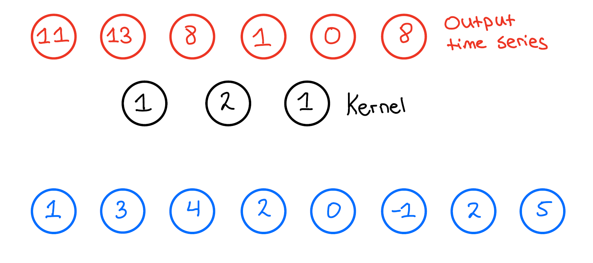

Temporal Convolutional Networks (TCN) which are a variaton of Convolutional Neural Networks (CNN), recently have been used by deep learning practitioners to solve time series tasks with promising and successful outcomes as seen here [CITE]. I for one have employed TCNs for detecting Arythmia in ECG signals with great success. In this short post I want to explain how these networks work, how they differ from normal CNNs and take a look into the computational workload.

For sake of illusration I will explain all of these concepts here in 1D, but they also work in higher dimensions. First let us look at normal a CNN, let's assume that we have one layer, which has a kernel size of 3 and 1 filter. And let's assume that we have a input time series that looks like the one here below:


When we then want to apply the 1D convolution to this input time series we do the following: We take our kernel size, which is 3, and slide it over the input time series to produce a output time series. Now how does this actually look like? Let's look at the first output of the output time series and see how that is produced,

We then slide the kernel over the whole input time series and get the following output:

Now first thing we notice is that the output time series is not the same length as the input time series. This is because we do not do any padding, and we can calculate the output length by the following formula:
$$
T_{out} = T_{in} - (k-1)
$$
Where $k$ is the kernel size. TCNs work in a very similar way, with one addidional factor which is called dilation. Dilation is a way to increase the receptive field size of the network, with low cost to the number of operations needed. Let's look at a similar 1D convolution as before, but here we add the factor of $D = 2$ where $D$ stands for dilation. Note that in normal CNNs, dilation is fixed at $1$:


As we can see adding the factor of dilation into our simple convolutional example radically changes the output time series:

Another thing that has changed is the size of our output series, as it is now not of length 6 but of length 4. This is since our formula before changes slightly with the addition of a dilation factor:
$$
T_{out} = T_{in} - (k-1)*D
$$
We can also see that this also holds true for normal convolutions as the dilation there is simply $D = 1$. One thing I noted here above was the 'Receptive Field Size (RFS)'. This is essentially how much of the time series each output node sees for computation. In this simple case we have here above the formula is simply:
$$
RFS = (k-1) * D + 1
$$
For the first case our RFS was simply $RFS = 3$ since $D =1$ and $k = 3$. Now for the dilated case this RFS increases to $RFS = 5$. Often when working with time series problems we want our network to be able output a time-series that is causal, meaning that when we calculate each time step we do not look into the future. To do so we need to add zero padding on the left hand side of the input time series. The size of the padding depends on both the kernel size and the dilation factor:
$$
Padding = (k-1) * D
$$

Having this causal padding introduces an output time series that is the same length as our previous one simply because we know that $T_{in}^* = T_{in} + (k-1) * D$ and plugging that into the formula above gives us $T_{out} = T_{in}$. 

The last building block we need to introduce to be able to fully introduce the TCN network is the Residual block. 

The residual block consists of two dilated causal convolutions with normaliztion, non-linear activation and dropout inbetween. These residual blocks are then stacked on top of each other to build a network that has a receptive field size that fits the task at hand. Note that in these TCN networks the dilation factor is exponentially increased the more blocks you add to the network. The calculation of the receptive field size then changes a bit and becomes:
$$
RFS = 1 + (2^L -1)(k-1)*2
$$
Where $L$ stands for the number of residual blocks that are stacked on top of each other. 

Now let's look at a code example of a TCN tackling a time series task (Both in PyTorch and Tensorflow/Keras). 


We will focus on the FordA dataset from the [UCR/UEA archive](https://www.cs.ucr.edu/~eamonn/time_series_data_2018/). We base the data preprocessing of the one availale online from Keras, for further information on why certain steps in the data preprocessing were done please take a look at the source: See [here](https://keras.io/examples/timeseries/timeseries_classification_from_scratch/) 


```python
from tensorflow import keras
import numpy as np
import matplotlib.pyplot as plt


def readucr(filename):
    data = np.loadtxt(filename, delimiter="\t")
    y = data[:, 0]
    x = data[:, 1:]
    return x, y.astype(int)


root_url = "https://raw.githubusercontent.com/hfawaz/cd-diagram/master/FordA/"

x_train, y_train = readucr(root_url + "FordA_TRAIN.tsv")
x_test, y_test = readucr(root_url + "FordA_TEST.tsv")
x_train = x_train.reshape((x_train.shape[0], x_train.shape[1], 1))
x_test = x_test.reshape((x_test.shape[0], x_test.shape[1], 1))
num_classes = len(np.unique(y_train))
print("We have " + str(num_classes) + " classes")
idx = np.random.permutation(len(x_train))
x_train = x_train[idx]
y_train = y_train[idx]
y_train[y_train == -1] = 0
y_test[y_test == -1] = 0
```

    We have 2 classes


Next we make the TCN model, we have a time series of length 500 in the dataset so we must model the receptive field size of the network to be equal or more than 500. We have two variables we can change to influence the receptive field size, the kernel size and then the number of layers of the TCN.

We will work with a kernel size of 10 and 5 layers as that gives us a RFS = 1 + (2^5-1)(10-1)*2 = 559 > 500.


```python
from keras.models import Model
from keras.layers.core import Dense, Activation
from keras.layers.convolutional import Conv1D
from keras.layers import Dropout, Add, Lambda, Flatten, Input, BatchNormalization


def TCN(nb_classes,Chans=1, Samples=500, layers=5, kernel_s=10,filt=10, dropout=0,activation='elu'):
    regRate=.25
    input1 = Input(shape = (Samples, Chans))
    x1 = Conv1D(filt,kernel_size=kernel_s,dilation_rate=1,activation=activation, padding = 'causal',kernel_initializer='he_uniform')(input1)
    x1 = BatchNormalization()(x1)
    x1 = Dropout(dropout)(x1)
    x1 = Conv1D(filt,kernel_size=kernel_s,dilation_rate=1,activation=activation, padding = 'causal',kernel_initializer='he_uniform')(x1)
    x1 = BatchNormalization()(x1)
    x1 = Dropout(dropout)(x1)
    conv = Conv1D(filt,kernel_size=1,padding='same')(input1)
    added_1 = Add()([x1, conv])
    out = Activation(activation)(added_1)

    
    for i in range(layers-1):
        x = Conv1D(filt,kernel_size=kernel_s,dilation_rate=2**(i+1),activation=activation, padding = 'causal',kernel_initializer='he_uniform')(out)
        x = BatchNormalization()(x)
        x = Dropout(dropout)(x)
        x = Conv1D(filt,kernel_size=kernel_s,dilation_rate=2**(i+1),activation=activation, padding = 'causal',kernel_initializer='he_uniform')(x)
        x = BatchNormalization()(x)
        x = Dropout(dropout)(x)

        added = Add()([x, out])
        out = Activation(activation)(added)
    out = Lambda(lambda x: x[:,-1,:])(out)
    dense        = Dense(nb_classes, name = 'dense')(out)
    softmax      = Activation('softmax', name = 'softmax')(dense)
    
    return Model(inputs=input1,outputs=softmax)

TCN_model_1 = TCN(nb_classes = 2,filt=5)
TCN_model_1.summary()

```

    Model: "model"
    __________________________________________________________________________________________________
     Layer (type)                   Output Shape         Param #     Connected to                     
    ==================================================================================================
     input_1 (InputLayer)           [(None, 500, 1)]     0           []                               
                                                                                                      
     conv1d (Conv1D)                (None, 500, 5)       55          ['input_1[0][0]']                
                                                                                                      
     batch_normalization (BatchNorm  (None, 500, 5)      20          ['conv1d[0][0]']                 
     alization)                                                                                       
                                                                                                      
     dropout (Dropout)              (None, 500, 5)       0           ['batch_normalization[0][0]']    
                                                                                                      
     conv1d_1 (Conv1D)              (None, 500, 5)       255         ['dropout[0][0]']                
                                                                                                      
     batch_normalization_1 (BatchNo  (None, 500, 5)      20          ['conv1d_1[0][0]']               
     rmalization)                                                                                     
                                                                                                      
     dropout_1 (Dropout)            (None, 500, 5)       0           ['batch_normalization_1[0][0]']  
                                                                                                      
     conv1d_2 (Conv1D)              (None, 500, 5)       10          ['input_1[0][0]']                
                                                                                                      
     add (Add)                      (None, 500, 5)       0           ['dropout_1[0][0]',              
                                                                      'conv1d_2[0][0]']               
                                                                                                      
     activation (Activation)        (None, 500, 5)       0           ['add[0][0]']                    
                                                                                                      
     conv1d_3 (Conv1D)              (None, 500, 5)       255         ['activation[0][0]']             
                                                                                                      
     batch_normalization_2 (BatchNo  (None, 500, 5)      20          ['conv1d_3[0][0]']               
     rmalization)                                                                                     
                                                                                                      
     dropout_2 (Dropout)            (None, 500, 5)       0           ['batch_normalization_2[0][0]']  
                                                                                                      
     conv1d_4 (Conv1D)              (None, 500, 5)       255         ['dropout_2[0][0]']              
                                                                                                      
     batch_normalization_3 (BatchNo  (None, 500, 5)      20          ['conv1d_4[0][0]']               
     rmalization)                                                                                     
                                                                                                      
     dropout_3 (Dropout)            (None, 500, 5)       0           ['batch_normalization_3[0][0]']  
                                                                                                      
     add_1 (Add)                    (None, 500, 5)       0           ['dropout_3[0][0]',              
                                                                      'activation[0][0]']             
                                                                                                      
     activation_1 (Activation)      (None, 500, 5)       0           ['add_1[0][0]']                  
                                                                                                      
     conv1d_5 (Conv1D)              (None, 500, 5)       255         ['activation_1[0][0]']           
                                                                                                      
     batch_normalization_4 (BatchNo  (None, 500, 5)      20          ['conv1d_5[0][0]']               
     rmalization)                                                                                     
                                                                                                      
     dropout_4 (Dropout)            (None, 500, 5)       0           ['batch_normalization_4[0][0]']  
                                                                                                      
     conv1d_6 (Conv1D)              (None, 500, 5)       255         ['dropout_4[0][0]']              
                                                                                                      
     batch_normalization_5 (BatchNo  (None, 500, 5)      20          ['conv1d_6[0][0]']               
     rmalization)                                                                                     
                                                                                                      
     dropout_5 (Dropout)            (None, 500, 5)       0           ['batch_normalization_5[0][0]']  
                                                                                                      
     add_2 (Add)                    (None, 500, 5)       0           ['dropout_5[0][0]',              
                                                                      'activation_1[0][0]']           
                                                                                                      
     activation_2 (Activation)      (None, 500, 5)       0           ['add_2[0][0]']                  
                                                                                                      
     conv1d_7 (Conv1D)              (None, 500, 5)       255         ['activation_2[0][0]']           
                                                                                                      
     batch_normalization_6 (BatchNo  (None, 500, 5)      20          ['conv1d_7[0][0]']               
     rmalization)                                                                                     
                                                                                                      
     dropout_6 (Dropout)            (None, 500, 5)       0           ['batch_normalization_6[0][0]']  
                                                                                                      
     conv1d_8 (Conv1D)              (None, 500, 5)       255         ['dropout_6[0][0]']              
                                                                                                      
     batch_normalization_7 (BatchNo  (None, 500, 5)      20          ['conv1d_8[0][0]']               
     rmalization)                                                                                     
                                                                                                      
     dropout_7 (Dropout)            (None, 500, 5)       0           ['batch_normalization_7[0][0]']  
                                                                                                      
     add_3 (Add)                    (None, 500, 5)       0           ['dropout_7[0][0]',              
                                                                      'activation_2[0][0]']           
                                                                                                      
     activation_3 (Activation)      (None, 500, 5)       0           ['add_3[0][0]']                  
                                                                                                      
     conv1d_9 (Conv1D)              (None, 500, 5)       255         ['activation_3[0][0]']           
                                                                                                      
     batch_normalization_8 (BatchNo  (None, 500, 5)      20          ['conv1d_9[0][0]']               
     rmalization)                                                                                     
                                                                                                      
     dropout_8 (Dropout)            (None, 500, 5)       0           ['batch_normalization_8[0][0]']  
                                                                                                      
     conv1d_10 (Conv1D)             (None, 500, 5)       255         ['dropout_8[0][0]']              
                                                                                                      
     batch_normalization_9 (BatchNo  (None, 500, 5)      20          ['conv1d_10[0][0]']              
     rmalization)                                                                                     
                                                                                                      
     dropout_9 (Dropout)            (None, 500, 5)       0           ['batch_normalization_9[0][0]']  
                                                                                                      
     add_4 (Add)                    (None, 500, 5)       0           ['dropout_9[0][0]',              
                                                                      'activation_3[0][0]']           
                                                                                                      
     activation_4 (Activation)      (None, 500, 5)       0           ['add_4[0][0]']                  
                                                                                                      
     lambda (Lambda)                (None, 5)            0           ['activation_4[0][0]']           
                                                                                                      
     dense (Dense)                  (None, 2)            12          ['lambda[0][0]']                 
                                                                                                      
     softmax (Activation)           (None, 2)            0           ['dense[0][0]']                  
                                                                                                      
    ==================================================================================================
    Total params: 2,572
    Trainable params: 2,472
    Non-trainable params: 100
    __________________________________________________________________________________________________


While looking at the summary of the TCN we see that we have roughly 2372 trainable parameters, we can decrease and increase this number by increasing the number of filters the network has. Let's first work with 5 filters and see how well the network does.

We do the same proccedure as done in the Keras example, with learning rate reduction and early stopping depending on validation loss.


```python
epochs = 500
batch_size = 32

callbacks = [
    keras.callbacks.ModelCheckpoint(
        "best_model_1.h5", save_best_only=True, monitor="val_loss"
    ),
    keras.callbacks.ReduceLROnPlateau(
        monitor="val_loss", factor=0.5, patience=20, min_lr=0.0001
    ),
    keras.callbacks.EarlyStopping(monitor="val_loss", patience=50, verbose=1),
]
TCN_model_1.compile(
    optimizer="adam",
    loss="sparse_categorical_crossentropy",
    metrics=["sparse_categorical_accuracy"],
)
history = TCN_model_1.fit(
    x_train,
    y_train,
    batch_size=batch_size,
    epochs=epochs,
    callbacks=callbacks,
    validation_split=0.2,
    verbose=1,
)
```

    Epoch 1/500
    90/90 [==============================] - 11s 19ms/step - loss: 0.9073 - sparse_categorical_accuracy: 0.5316 - val_loss: 0.7730 - val_sparse_categorical_accuracy: 0.5811 - lr: 0.0010
    Epoch 2/500
    90/90 [==============================] - 1s 12ms/step - loss: 0.4850 - sparse_categorical_accuracy: 0.7628 - val_loss: 0.6214 - val_sparse_categorical_accuracy: 0.7157 - lr: 0.0010
    Epoch 3/500
    90/90 [==============================] - 1s 12ms/step - loss: 0.3060 - sparse_categorical_accuracy: 0.8715 - val_loss: 0.5304 - val_sparse_categorical_accuracy: 0.7587 - lr: 0.0010
    Epoch 4/500
    90/90 [==============================] - 1s 12ms/step - loss: 0.2572 - sparse_categorical_accuracy: 0.8965 - val_loss: 0.2283 - val_sparse_categorical_accuracy: 0.9223 - lr: 0.0010
    Epoch 5/500
    90/90 [==============================] - 1s 11ms/step - loss: 0.2326 - sparse_categorical_accuracy: 0.9059 - val_loss: 0.3197 - val_sparse_categorical_accuracy: 0.8558 - lr: 0.0010
    Epoch 6/500
    90/90 [==============================] - 1s 11ms/step - loss: 0.2053 - sparse_categorical_accuracy: 0.9177 - val_loss: 0.2882 - val_sparse_categorical_accuracy: 0.8835 - lr: 0.0010
    Epoch 7/500
    90/90 [==============================] - 1s 11ms/step - loss: 0.1787 - sparse_categorical_accuracy: 0.9299 - val_loss: 0.2490 - val_sparse_categorical_accuracy: 0.9071 - lr: 0.0010
    Epoch 8/500
    90/90 [==============================] - 1s 13ms/step - loss: 0.1822 - sparse_categorical_accuracy: 0.9253 - val_loss: 0.1895 - val_sparse_categorical_accuracy: 0.9265 - lr: 0.0010
    Epoch 9/500
    90/90 [==============================] - 1s 13ms/step - loss: 0.1759 - sparse_categorical_accuracy: 0.9260 - val_loss: 0.3006 - val_sparse_categorical_accuracy: 0.8641 - lr: 0.0010
    Epoch 10/500
    90/90 [==============================] - 1s 14ms/step - loss: 0.1602 - sparse_categorical_accuracy: 0.9358 - val_loss: 0.1886 - val_sparse_categorical_accuracy: 0.9307 - lr: 0.0010
    Epoch 11/500
    90/90 [==============================] - 1s 12ms/step - loss: 0.1575 - sparse_categorical_accuracy: 0.9372 - val_loss: 0.1809 - val_sparse_categorical_accuracy: 0.9265 - lr: 0.0010
    Epoch 12/500
    90/90 [==============================] - 1s 11ms/step - loss: 0.1385 - sparse_categorical_accuracy: 0.9413 - val_loss: 0.2110 - val_sparse_categorical_accuracy: 0.9098 - lr: 0.0010
    Epoch 13/500
    90/90 [==============================] - 1s 11ms/step - loss: 0.1411 - sparse_categorical_accuracy: 0.9420 - val_loss: 0.1835 - val_sparse_categorical_accuracy: 0.9279 - lr: 0.0010
    Epoch 14/500
    90/90 [==============================] - 1s 11ms/step - loss: 0.1272 - sparse_categorical_accuracy: 0.9476 - val_loss: 0.1945 - val_sparse_categorical_accuracy: 0.9209 - lr: 0.0010
    Epoch 15/500
    90/90 [==============================] - 1s 10ms/step - loss: 0.1289 - sparse_categorical_accuracy: 0.9462 - val_loss: 0.2177 - val_sparse_categorical_accuracy: 0.9182 - lr: 0.0010
    Epoch 16/500
    90/90 [==============================] - 1s 11ms/step - loss: 0.1201 - sparse_categorical_accuracy: 0.9510 - val_loss: 0.2162 - val_sparse_categorical_accuracy: 0.9209 - lr: 0.0010
    Epoch 17/500
    90/90 [==============================] - 1s 11ms/step - loss: 0.1181 - sparse_categorical_accuracy: 0.9552 - val_loss: 0.1991 - val_sparse_categorical_accuracy: 0.9237 - lr: 0.0010
    Epoch 18/500
    90/90 [==============================] - 1s 11ms/step - loss: 0.1035 - sparse_categorical_accuracy: 0.9639 - val_loss: 0.2218 - val_sparse_categorical_accuracy: 0.9140 - lr: 0.0010
    Epoch 19/500
    90/90 [==============================] - 1s 11ms/step - loss: 0.1153 - sparse_categorical_accuracy: 0.9542 - val_loss: 0.2060 - val_sparse_categorical_accuracy: 0.9140 - lr: 0.0010
    Epoch 20/500
    90/90 [==============================] - 1s 11ms/step - loss: 0.1035 - sparse_categorical_accuracy: 0.9604 - val_loss: 0.2065 - val_sparse_categorical_accuracy: 0.9140 - lr: 0.0010
    Epoch 21/500
    90/90 [==============================] - 1s 11ms/step - loss: 0.0979 - sparse_categorical_accuracy: 0.9646 - val_loss: 0.2706 - val_sparse_categorical_accuracy: 0.9043 - lr: 0.0010
    Epoch 22/500
    90/90 [==============================] - 1s 11ms/step - loss: 0.0970 - sparse_categorical_accuracy: 0.9625 - val_loss: 0.2333 - val_sparse_categorical_accuracy: 0.9112 - lr: 0.0010
    Epoch 23/500
    90/90 [==============================] - 1s 11ms/step - loss: 0.1058 - sparse_categorical_accuracy: 0.9590 - val_loss: 0.2240 - val_sparse_categorical_accuracy: 0.9209 - lr: 0.0010
    Epoch 24/500
    90/90 [==============================] - 1s 11ms/step - loss: 0.0907 - sparse_categorical_accuracy: 0.9635 - val_loss: 0.2295 - val_sparse_categorical_accuracy: 0.9140 - lr: 0.0010
    Epoch 25/500
    90/90 [==============================] - 1s 11ms/step - loss: 0.0747 - sparse_categorical_accuracy: 0.9736 - val_loss: 0.2627 - val_sparse_categorical_accuracy: 0.9085 - lr: 0.0010
    Epoch 26/500
    90/90 [==============================] - 1s 11ms/step - loss: 0.0840 - sparse_categorical_accuracy: 0.9649 - val_loss: 0.2773 - val_sparse_categorical_accuracy: 0.9085 - lr: 0.0010
    Epoch 27/500
    90/90 [==============================] - 1s 15ms/step - loss: 0.0710 - sparse_categorical_accuracy: 0.9712 - val_loss: 0.2348 - val_sparse_categorical_accuracy: 0.9223 - lr: 0.0010
    Epoch 28/500
    90/90 [==============================] - 1s 11ms/step - loss: 0.0692 - sparse_categorical_accuracy: 0.9712 - val_loss: 0.2492 - val_sparse_categorical_accuracy: 0.9223 - lr: 0.0010
    Epoch 29/500
    90/90 [==============================] - 1s 11ms/step - loss: 0.0688 - sparse_categorical_accuracy: 0.9715 - val_loss: 0.2822 - val_sparse_categorical_accuracy: 0.9085 - lr: 0.0010
    Epoch 30/500
    90/90 [==============================] - 1s 12ms/step - loss: 0.0671 - sparse_categorical_accuracy: 0.9726 - val_loss: 0.2708 - val_sparse_categorical_accuracy: 0.9098 - lr: 0.0010
    Epoch 31/500
    90/90 [==============================] - 1s 11ms/step - loss: 0.0640 - sparse_categorical_accuracy: 0.9760 - val_loss: 0.3219 - val_sparse_categorical_accuracy: 0.9057 - lr: 0.0010
    Epoch 32/500
    90/90 [==============================] - 1s 12ms/step - loss: 0.0485 - sparse_categorical_accuracy: 0.9844 - val_loss: 0.2700 - val_sparse_categorical_accuracy: 0.9223 - lr: 5.0000e-04
    Epoch 33/500
    90/90 [==============================] - 1s 11ms/step - loss: 0.0472 - sparse_categorical_accuracy: 0.9823 - val_loss: 0.2686 - val_sparse_categorical_accuracy: 0.9251 - lr: 5.0000e-04
    Epoch 34/500
    90/90 [==============================] - 1s 11ms/step - loss: 0.0425 - sparse_categorical_accuracy: 0.9889 - val_loss: 0.3027 - val_sparse_categorical_accuracy: 0.9126 - lr: 5.0000e-04
    Epoch 35/500
    90/90 [==============================] - 1s 11ms/step - loss: 0.0457 - sparse_categorical_accuracy: 0.9844 - val_loss: 0.2937 - val_sparse_categorical_accuracy: 0.9112 - lr: 5.0000e-04
    Epoch 36/500
    90/90 [==============================] - 1s 11ms/step - loss: 0.0465 - sparse_categorical_accuracy: 0.9854 - val_loss: 0.3020 - val_sparse_categorical_accuracy: 0.9154 - lr: 5.0000e-04
    Epoch 37/500
    90/90 [==============================] - 1s 12ms/step - loss: 0.0423 - sparse_categorical_accuracy: 0.9875 - val_loss: 0.2923 - val_sparse_categorical_accuracy: 0.9168 - lr: 5.0000e-04
    Epoch 38/500
    90/90 [==============================] - 1s 11ms/step - loss: 0.0398 - sparse_categorical_accuracy: 0.9882 - val_loss: 0.2980 - val_sparse_categorical_accuracy: 0.9154 - lr: 5.0000e-04
    Epoch 39/500
    90/90 [==============================] - 1s 11ms/step - loss: 0.0347 - sparse_categorical_accuracy: 0.9903 - val_loss: 0.2932 - val_sparse_categorical_accuracy: 0.9223 - lr: 5.0000e-04
    Epoch 40/500
    90/90 [==============================] - 1s 11ms/step - loss: 0.0327 - sparse_categorical_accuracy: 0.9906 - val_loss: 0.3039 - val_sparse_categorical_accuracy: 0.9182 - lr: 5.0000e-04
    Epoch 41/500
    90/90 [==============================] - 1s 11ms/step - loss: 0.0378 - sparse_categorical_accuracy: 0.9878 - val_loss: 0.3227 - val_sparse_categorical_accuracy: 0.9154 - lr: 5.0000e-04
    Epoch 42/500
    90/90 [==============================] - 1s 12ms/step - loss: 0.0462 - sparse_categorical_accuracy: 0.9830 - val_loss: 0.3422 - val_sparse_categorical_accuracy: 0.9126 - lr: 5.0000e-04
    Epoch 43/500
    90/90 [==============================] - 1s 11ms/step - loss: 0.0359 - sparse_categorical_accuracy: 0.9882 - val_loss: 0.3326 - val_sparse_categorical_accuracy: 0.9126 - lr: 5.0000e-04
    Epoch 44/500
    90/90 [==============================] - 1s 11ms/step - loss: 0.0305 - sparse_categorical_accuracy: 0.9899 - val_loss: 0.3201 - val_sparse_categorical_accuracy: 0.9154 - lr: 5.0000e-04
    Epoch 45/500
    90/90 [==============================] - 1s 11ms/step - loss: 0.0334 - sparse_categorical_accuracy: 0.9889 - val_loss: 0.3470 - val_sparse_categorical_accuracy: 0.9154 - lr: 5.0000e-04
    Epoch 46/500
    90/90 [==============================] - 1s 11ms/step - loss: 0.0281 - sparse_categorical_accuracy: 0.9910 - val_loss: 0.3306 - val_sparse_categorical_accuracy: 0.9154 - lr: 5.0000e-04
    Epoch 47/500
    90/90 [==============================] - 1s 11ms/step - loss: 0.0291 - sparse_categorical_accuracy: 0.9906 - val_loss: 0.3427 - val_sparse_categorical_accuracy: 0.9251 - lr: 5.0000e-04
    Epoch 48/500
    90/90 [==============================] - 1s 10ms/step - loss: 0.0286 - sparse_categorical_accuracy: 0.9920 - val_loss: 0.3494 - val_sparse_categorical_accuracy: 0.9223 - lr: 5.0000e-04
    Epoch 49/500
    90/90 [==============================] - 1s 10ms/step - loss: 0.0322 - sparse_categorical_accuracy: 0.9903 - val_loss: 0.3470 - val_sparse_categorical_accuracy: 0.9182 - lr: 5.0000e-04
    Epoch 50/500
    90/90 [==============================] - 1s 11ms/step - loss: 0.0326 - sparse_categorical_accuracy: 0.9910 - val_loss: 0.3467 - val_sparse_categorical_accuracy: 0.9196 - lr: 5.0000e-04
    Epoch 51/500
    90/90 [==============================] - 1s 11ms/step - loss: 0.0227 - sparse_categorical_accuracy: 0.9948 - val_loss: 0.3542 - val_sparse_categorical_accuracy: 0.9126 - lr: 5.0000e-04
    Epoch 52/500
    90/90 [==============================] - 1s 11ms/step - loss: 0.0284 - sparse_categorical_accuracy: 0.9899 - val_loss: 0.3419 - val_sparse_categorical_accuracy: 0.9112 - lr: 2.5000e-04
    Epoch 53/500
    90/90 [==============================] - 1s 11ms/step - loss: 0.0230 - sparse_categorical_accuracy: 0.9941 - val_loss: 0.3557 - val_sparse_categorical_accuracy: 0.9098 - lr: 2.5000e-04
    Epoch 54/500
    90/90 [==============================] - 1s 16ms/step - loss: 0.0213 - sparse_categorical_accuracy: 0.9955 - val_loss: 0.3462 - val_sparse_categorical_accuracy: 0.9182 - lr: 2.5000e-04
    Epoch 55/500
    90/90 [==============================] - 2s 19ms/step - loss: 0.0207 - sparse_categorical_accuracy: 0.9927 - val_loss: 0.3541 - val_sparse_categorical_accuracy: 0.9196 - lr: 2.5000e-04
    Epoch 56/500
    90/90 [==============================] - 1s 11ms/step - loss: 0.0215 - sparse_categorical_accuracy: 0.9934 - val_loss: 0.3517 - val_sparse_categorical_accuracy: 0.9126 - lr: 2.5000e-04
    Epoch 57/500
    90/90 [==============================] - 1s 12ms/step - loss: 0.0241 - sparse_categorical_accuracy: 0.9941 - val_loss: 0.3458 - val_sparse_categorical_accuracy: 0.9196 - lr: 2.5000e-04
    Epoch 58/500
    90/90 [==============================] - 1s 11ms/step - loss: 0.0176 - sparse_categorical_accuracy: 0.9965 - val_loss: 0.3563 - val_sparse_categorical_accuracy: 0.9237 - lr: 2.5000e-04
    Epoch 59/500
    90/90 [==============================] - 1s 11ms/step - loss: 0.0193 - sparse_categorical_accuracy: 0.9948 - val_loss: 0.3525 - val_sparse_categorical_accuracy: 0.9154 - lr: 2.5000e-04
    Epoch 60/500
    90/90 [==============================] - 1s 12ms/step - loss: 0.0166 - sparse_categorical_accuracy: 0.9965 - val_loss: 0.3577 - val_sparse_categorical_accuracy: 0.9237 - lr: 2.5000e-04
    Epoch 61/500
    90/90 [==============================] - 1s 11ms/step - loss: 0.0168 - sparse_categorical_accuracy: 0.9972 - val_loss: 0.3599 - val_sparse_categorical_accuracy: 0.9182 - lr: 2.5000e-04
    Epoch 61: early stopping


We can see that our model does quite well, having a final validation accuracy of around 91%, looking at the training and validation accuracy graph we can see that it very quickly gets up to this 91% and then doesn't improve


```python
metric = "sparse_categorical_accuracy"
plt.figure()
plt.plot(history.history[metric])
plt.plot(history.history["val_" + metric])
plt.title("model " + metric)
plt.ylabel(metric, fontsize="large")
plt.xlabel("epoch", fontsize="large")
plt.legend(["train", "val"], loc="best")
plt.show()
plt.close()
```


Lets try increasing the number of filters the network has to see if that improves the performance.


```python
TCN_model_2 = TCN(nb_classes = 2,filt=15)
TCN_model_2.summary()
epochs = 500
batch_size = 32

callbacks = [
    keras.callbacks.ModelCheckpoint(
        "best_model_2.h5", save_best_only=True, monitor="val_loss"
    ),
    keras.callbacks.ReduceLROnPlateau(
        monitor="val_loss", factor=0.5, patience=20, min_lr=0.0001
    ),
    keras.callbacks.EarlyStopping(monitor="val_loss", patience=50, verbose=1),
]
TCN_model_2.compile(
    optimizer="adam",
    loss="sparse_categorical_crossentropy",
    metrics=["sparse_categorical_accuracy"],
)

```

    Model: "model_1"
    __________________________________________________________________________________________________
     Layer (type)                   Output Shape         Param #     Connected to                     
    ==================================================================================================
     input_2 (InputLayer)           [(None, 500, 1)]     0           []                               
                                                                                                      
     conv1d_11 (Conv1D)             (None, 500, 15)      165         ['input_2[0][0]']                
                                                                                                      
     batch_normalization_10 (BatchN  (None, 500, 15)     60          ['conv1d_11[0][0]']              
     ormalization)                                                                                    
                                                                                                      
     dropout_10 (Dropout)           (None, 500, 15)      0           ['batch_normalization_10[0][0]'] 
                                                                                                      
     conv1d_12 (Conv1D)             (None, 500, 15)      2265        ['dropout_10[0][0]']             
                                                                                                      
     batch_normalization_11 (BatchN  (None, 500, 15)     60          ['conv1d_12[0][0]']              
     ormalization)                                                                                    
                                                                                                      
     dropout_11 (Dropout)           (None, 500, 15)      0           ['batch_normalization_11[0][0]'] 
                                                                                                      
     conv1d_13 (Conv1D)             (None, 500, 15)      30          ['input_2[0][0]']                
                                                                                                      
     add_5 (Add)                    (None, 500, 15)      0           ['dropout_11[0][0]',             
                                                                      'conv1d_13[0][0]']              
                                                                                                      
     activation_5 (Activation)      (None, 500, 15)      0           ['add_5[0][0]']                  
                                                                                                      
     conv1d_14 (Conv1D)             (None, 500, 15)      2265        ['activation_5[0][0]']           
                                                                                                      
     batch_normalization_12 (BatchN  (None, 500, 15)     60          ['conv1d_14[0][0]']              
     ormalization)                                                                                    
                                                                                                      
     dropout_12 (Dropout)           (None, 500, 15)      0           ['batch_normalization_12[0][0]'] 
                                                                                                      
     conv1d_15 (Conv1D)             (None, 500, 15)      2265        ['dropout_12[0][0]']             
                                                                                                      
     batch_normalization_13 (BatchN  (None, 500, 15)     60          ['conv1d_15[0][0]']              
     ormalization)                                                                                    
                                                                                                      
     dropout_13 (Dropout)           (None, 500, 15)      0           ['batch_normalization_13[0][0]'] 
                                                                                                      
     add_6 (Add)                    (None, 500, 15)      0           ['dropout_13[0][0]',             
                                                                      'activation_5[0][0]']           
                                                                                                      
     activation_6 (Activation)      (None, 500, 15)      0           ['add_6[0][0]']                  
                                                                                                      
     conv1d_16 (Conv1D)             (None, 500, 15)      2265        ['activation_6[0][0]']           
                                                                                                      
     batch_normalization_14 (BatchN  (None, 500, 15)     60          ['conv1d_16[0][0]']              
     ormalization)                                                                                    
                                                                                                      
     dropout_14 (Dropout)           (None, 500, 15)      0           ['batch_normalization_14[0][0]'] 
                                                                                                      
     conv1d_17 (Conv1D)             (None, 500, 15)      2265        ['dropout_14[0][0]']             
                                                                                                      
     batch_normalization_15 (BatchN  (None, 500, 15)     60          ['conv1d_17[0][0]']              
     ormalization)                                                                                    
                                                                                                      
     dropout_15 (Dropout)           (None, 500, 15)      0           ['batch_normalization_15[0][0]'] 
                                                                                                      
     add_7 (Add)                    (None, 500, 15)      0           ['dropout_15[0][0]',             
                                                                      'activation_6[0][0]']           
                                                                                                      
     activation_7 (Activation)      (None, 500, 15)      0           ['add_7[0][0]']                  
                                                                                                      
     conv1d_18 (Conv1D)             (None, 500, 15)      2265        ['activation_7[0][0]']           
                                                                                                      
     batch_normalization_16 (BatchN  (None, 500, 15)     60          ['conv1d_18[0][0]']              
     ormalization)                                                                                    
                                                                                                      
     dropout_16 (Dropout)           (None, 500, 15)      0           ['batch_normalization_16[0][0]'] 
                                                                                                      
     conv1d_19 (Conv1D)             (None, 500, 15)      2265        ['dropout_16[0][0]']             
                                                                                                      
     batch_normalization_17 (BatchN  (None, 500, 15)     60          ['conv1d_19[0][0]']              
     ormalization)                                                                                    
                                                                                                      
     dropout_17 (Dropout)           (None, 500, 15)      0           ['batch_normalization_17[0][0]'] 
                                                                                                      
     add_8 (Add)                    (None, 500, 15)      0           ['dropout_17[0][0]',             
                                                                      'activation_7[0][0]']           
                                                                                                      
     activation_8 (Activation)      (None, 500, 15)      0           ['add_8[0][0]']                  
                                                                                                      
     conv1d_20 (Conv1D)             (None, 500, 15)      2265        ['activation_8[0][0]']           
                                                                                                      
     batch_normalization_18 (BatchN  (None, 500, 15)     60          ['conv1d_20[0][0]']              
     ormalization)                                                                                    
                                                                                                      
     dropout_18 (Dropout)           (None, 500, 15)      0           ['batch_normalization_18[0][0]'] 
                                                                                                      
     conv1d_21 (Conv1D)             (None, 500, 15)      2265        ['dropout_18[0][0]']             
                                                                                                      
     batch_normalization_19 (BatchN  (None, 500, 15)     60          ['conv1d_21[0][0]']              
     ormalization)                                                                                    
                                                                                                      
     dropout_19 (Dropout)           (None, 500, 15)      0           ['batch_normalization_19[0][0]'] 
                                                                                                      
     add_9 (Add)                    (None, 500, 15)      0           ['dropout_19[0][0]',             
                                                                      'activation_8[0][0]']           
                                                                                                      
     activation_9 (Activation)      (None, 500, 15)      0           ['add_9[0][0]']                  
                                                                                                      
     lambda_1 (Lambda)              (None, 15)           0           ['activation_9[0][0]']           
                                                                                                      
     dense (Dense)                  (None, 2)            32          ['lambda_1[0][0]']               
                                                                                                      
     softmax (Activation)           (None, 2)            0           ['dense[0][0]']                  
                                                                                                      
    ==================================================================================================
    Total params: 21,212
    Trainable params: 20,912
    Non-trainable params: 300
    __________________________________________________________________________________________________


```python
history = TCN_model_2.fit(
    x_train,
    y_train,
    batch_size=batch_size,
    epochs=epochs,
    callbacks=callbacks,
    validation_split=0.2,
    verbose=1,
)
```

    Epoch 1/500
    90/90 [==============================] - 5s 20ms/step - loss: 0.6911 - sparse_categorical_accuracy: 0.6896 - val_loss: 0.8369 - val_sparse_categorical_accuracy: 0.7295 - lr: 0.0010
    Epoch 2/500
    90/90 [==============================] - 1s 13ms/step - loss: 0.2282 - sparse_categorical_accuracy: 0.9062 - val_loss: 0.5429 - val_sparse_categorical_accuracy: 0.8169 - lr: 0.0010
    Epoch 3/500
    90/90 [==============================] - 1s 12ms/step - loss: 0.1734 - sparse_categorical_accuracy: 0.9312 - val_loss: 0.2895 - val_sparse_categorical_accuracy: 0.8890 - lr: 0.0010
    Epoch 4/500
    90/90 [==============================] - 1s 13ms/step - loss: 0.1495 - sparse_categorical_accuracy: 0.9410 - val_loss: 0.2560 - val_sparse_categorical_accuracy: 0.9168 - lr: 0.0010
    Epoch 5/500
    90/90 [==============================] - 1s 11ms/step - loss: 0.1312 - sparse_categorical_accuracy: 0.9479 - val_loss: 0.2856 - val_sparse_categorical_accuracy: 0.9043 - lr: 0.0010
    Epoch 6/500
    90/90 [==============================] - 1s 12ms/step - loss: 0.1132 - sparse_categorical_accuracy: 0.9545 - val_loss: 0.2248 - val_sparse_categorical_accuracy: 0.9098 - lr: 0.0010
    Epoch 7/500
    90/90 [==============================] - 1s 13ms/step - loss: 0.0961 - sparse_categorical_accuracy: 0.9628 - val_loss: 0.2171 - val_sparse_categorical_accuracy: 0.9237 - lr: 0.0010
    Epoch 8/500
    90/90 [==============================] - 1s 11ms/step - loss: 0.0887 - sparse_categorical_accuracy: 0.9663 - val_loss: 0.2463 - val_sparse_categorical_accuracy: 0.9251 - lr: 0.0010
    Epoch 9/500
    90/90 [==============================] - 1s 11ms/step - loss: 0.0856 - sparse_categorical_accuracy: 0.9698 - val_loss: 0.2291 - val_sparse_categorical_accuracy: 0.9126 - lr: 0.0010
    Epoch 10/500
    90/90 [==============================] - 1s 12ms/step - loss: 0.0553 - sparse_categorical_accuracy: 0.9806 - val_loss: 0.2476 - val_sparse_categorical_accuracy: 0.9112 - lr: 0.0010
    Epoch 11/500
    90/90 [==============================] - 1s 12ms/step - loss: 0.0467 - sparse_categorical_accuracy: 0.9861 - val_loss: 0.2884 - val_sparse_categorical_accuracy: 0.9071 - lr: 0.0010
    Epoch 12/500
    90/90 [==============================] - 1s 12ms/step - loss: 0.0312 - sparse_categorical_accuracy: 0.9944 - val_loss: 0.2448 - val_sparse_categorical_accuracy: 0.9237 - lr: 0.0010
    Epoch 13/500
    90/90 [==============================] - 1s 11ms/step - loss: 0.0378 - sparse_categorical_accuracy: 0.9878 - val_loss: 0.3012 - val_sparse_categorical_accuracy: 0.9057 - lr: 0.0010
    Epoch 14/500
    90/90 [==============================] - 1s 11ms/step - loss: 0.0416 - sparse_categorical_accuracy: 0.9882 - val_loss: 0.2748 - val_sparse_categorical_accuracy: 0.9126 - lr: 0.0010
    Epoch 15/500
    90/90 [==============================] - 1s 11ms/step - loss: 0.0386 - sparse_categorical_accuracy: 0.9875 - val_loss: 0.3705 - val_sparse_categorical_accuracy: 0.8932 - lr: 0.0010
    Epoch 16/500
    90/90 [==============================] - 1s 11ms/step - loss: 0.0316 - sparse_categorical_accuracy: 0.9889 - val_loss: 0.3182 - val_sparse_categorical_accuracy: 0.9085 - lr: 0.0010
    Epoch 17/500
    90/90 [==============================] - 1s 12ms/step - loss: 0.0271 - sparse_categorical_accuracy: 0.9913 - val_loss: 0.2807 - val_sparse_categorical_accuracy: 0.9140 - lr: 0.0010
    Epoch 18/500
    90/90 [==============================] - 1s 11ms/step - loss: 0.0168 - sparse_categorical_accuracy: 0.9976 - val_loss: 0.3539 - val_sparse_categorical_accuracy: 0.9029 - lr: 0.0010
    Epoch 19/500
    90/90 [==============================] - 1s 12ms/step - loss: 0.0134 - sparse_categorical_accuracy: 0.9972 - val_loss: 0.3170 - val_sparse_categorical_accuracy: 0.9029 - lr: 0.0010
    Epoch 20/500
    90/90 [==============================] - 1s 11ms/step - loss: 0.0124 - sparse_categorical_accuracy: 0.9976 - val_loss: 0.3178 - val_sparse_categorical_accuracy: 0.9112 - lr: 0.0010
    Epoch 21/500
    90/90 [==============================] - 1s 11ms/step - loss: 0.0096 - sparse_categorical_accuracy: 0.9990 - val_loss: 0.3138 - val_sparse_categorical_accuracy: 0.9196 - lr: 0.0010
    Epoch 22/500
    90/90 [==============================] - 1s 12ms/step - loss: 0.0123 - sparse_categorical_accuracy: 0.9965 - val_loss: 0.4104 - val_sparse_categorical_accuracy: 0.9029 - lr: 0.0010
    Epoch 23/500
    90/90 [==============================] - 1s 12ms/step - loss: 0.0193 - sparse_categorical_accuracy: 0.9941 - val_loss: 0.3890 - val_sparse_categorical_accuracy: 0.9168 - lr: 0.0010
    Epoch 24/500
    90/90 [==============================] - 1s 12ms/step - loss: 0.0193 - sparse_categorical_accuracy: 0.9927 - val_loss: 0.3831 - val_sparse_categorical_accuracy: 0.8960 - lr: 0.0010
    Epoch 25/500
    90/90 [==============================] - 1s 12ms/step - loss: 0.0129 - sparse_categorical_accuracy: 0.9969 - val_loss: 0.3603 - val_sparse_categorical_accuracy: 0.9279 - lr: 0.0010
    Epoch 26/500
    90/90 [==============================] - 1s 12ms/step - loss: 0.0133 - sparse_categorical_accuracy: 0.9969 - val_loss: 0.3407 - val_sparse_categorical_accuracy: 0.9126 - lr: 0.0010
    Epoch 27/500
    90/90 [==============================] - 1s 12ms/step - loss: 0.0213 - sparse_categorical_accuracy: 0.9924 - val_loss: 0.6079 - val_sparse_categorical_accuracy: 0.8821 - lr: 0.0010
    Epoch 28/500
    90/90 [==============================] - 1s 12ms/step - loss: 0.0130 - sparse_categorical_accuracy: 0.9969 - val_loss: 0.3650 - val_sparse_categorical_accuracy: 0.9237 - lr: 5.0000e-04
    Epoch 29/500
    90/90 [==============================] - 1s 12ms/step - loss: 0.0042 - sparse_categorical_accuracy: 0.9997 - val_loss: 0.3288 - val_sparse_categorical_accuracy: 0.9223 - lr: 5.0000e-04
    Epoch 30/500
    90/90 [==============================] - 1s 11ms/step - loss: 0.0038 - sparse_categorical_accuracy: 0.9997 - val_loss: 0.3254 - val_sparse_categorical_accuracy: 0.9237 - lr: 5.0000e-04
    Epoch 31/500
    90/90 [==============================] - 1s 11ms/step - loss: 0.0022 - sparse_categorical_accuracy: 1.0000 - val_loss: 0.3171 - val_sparse_categorical_accuracy: 0.9265 - lr: 5.0000e-04
    Epoch 32/500
    90/90 [==============================] - 1s 12ms/step - loss: 0.0026 - sparse_categorical_accuracy: 1.0000 - val_loss: 0.3298 - val_sparse_categorical_accuracy: 0.9182 - lr: 5.0000e-04
    Epoch 33/500
    90/90 [==============================] - 1s 12ms/step - loss: 0.0050 - sparse_categorical_accuracy: 0.9983 - val_loss: 0.4057 - val_sparse_categorical_accuracy: 0.9029 - lr: 5.0000e-04
    Epoch 34/500
    90/90 [==============================] - 1s 11ms/step - loss: 0.0024 - sparse_categorical_accuracy: 0.9997 - val_loss: 0.3382 - val_sparse_categorical_accuracy: 0.9182 - lr: 5.0000e-04
    Epoch 35/500
    90/90 [==============================] - 1s 11ms/step - loss: 0.0030 - sparse_categorical_accuracy: 0.9997 - val_loss: 0.3367 - val_sparse_categorical_accuracy: 0.9223 - lr: 5.0000e-04
    Epoch 36/500
    90/90 [==============================] - 1s 11ms/step - loss: 0.0013 - sparse_categorical_accuracy: 1.0000 - val_loss: 0.3307 - val_sparse_categorical_accuracy: 0.9265 - lr: 5.0000e-04
    Epoch 37/500
    90/90 [==============================] - 1s 11ms/step - loss: 0.0029 - sparse_categorical_accuracy: 0.9997 - val_loss: 0.3362 - val_sparse_categorical_accuracy: 0.9237 - lr: 5.0000e-04
    Epoch 38/500
    90/90 [==============================] - 1s 12ms/step - loss: 0.0011 - sparse_categorical_accuracy: 1.0000 - val_loss: 0.3520 - val_sparse_categorical_accuracy: 0.9237 - lr: 5.0000e-04
    Epoch 39/500
    90/90 [==============================] - 1s 11ms/step - loss: 0.0023 - sparse_categorical_accuracy: 0.9997 - val_loss: 0.3515 - val_sparse_categorical_accuracy: 0.9237 - lr: 5.0000e-04
    Epoch 40/500
    90/90 [==============================] - 1s 12ms/step - loss: 0.0019 - sparse_categorical_accuracy: 1.0000 - val_loss: 0.3628 - val_sparse_categorical_accuracy: 0.9196 - lr: 5.0000e-04
    Epoch 41/500
    90/90 [==============================] - 1s 12ms/step - loss: 0.0015 - sparse_categorical_accuracy: 1.0000 - val_loss: 0.3682 - val_sparse_categorical_accuracy: 0.9237 - lr: 5.0000e-04
    Epoch 42/500
    90/90 [==============================] - 1s 11ms/step - loss: 0.0022 - sparse_categorical_accuracy: 0.9997 - val_loss: 0.3816 - val_sparse_categorical_accuracy: 0.9126 - lr: 5.0000e-04
    Epoch 43/500
    90/90 [==============================] - 1s 11ms/step - loss: 0.0016 - sparse_categorical_accuracy: 0.9997 - val_loss: 0.3488 - val_sparse_categorical_accuracy: 0.9293 - lr: 5.0000e-04
    Epoch 44/500
    90/90 [==============================] - 1s 12ms/step - loss: 0.0023 - sparse_categorical_accuracy: 0.9993 - val_loss: 0.3604 - val_sparse_categorical_accuracy: 0.9293 - lr: 5.0000e-04
    Epoch 45/500
    90/90 [==============================] - 1s 11ms/step - loss: 0.0023 - sparse_categorical_accuracy: 0.9990 - val_loss: 0.3480 - val_sparse_categorical_accuracy: 0.9265 - lr: 5.0000e-04
    Epoch 46/500
    90/90 [==============================] - 1s 12ms/step - loss: 0.0019 - sparse_categorical_accuracy: 0.9997 - val_loss: 0.3511 - val_sparse_categorical_accuracy: 0.9196 - lr: 5.0000e-04
    Epoch 47/500
    90/90 [==============================] - 1s 11ms/step - loss: 0.0014 - sparse_categorical_accuracy: 1.0000 - val_loss: 0.3442 - val_sparse_categorical_accuracy: 0.9251 - lr: 5.0000e-04
    Epoch 48/500
    90/90 [==============================] - 1s 11ms/step - loss: 8.3463e-04 - sparse_categorical_accuracy: 1.0000 - val_loss: 0.3625 - val_sparse_categorical_accuracy: 0.9223 - lr: 2.5000e-04
    Epoch 49/500
    90/90 [==============================] - 1s 12ms/step - loss: 0.0014 - sparse_categorical_accuracy: 0.9997 - val_loss: 0.3571 - val_sparse_categorical_accuracy: 0.9196 - lr: 2.5000e-04
    Epoch 50/500
    90/90 [==============================] - 1s 11ms/step - loss: 8.6414e-04 - sparse_categorical_accuracy: 1.0000 - val_loss: 0.3591 - val_sparse_categorical_accuracy: 0.9251 - lr: 2.5000e-04
    Epoch 51/500
    90/90 [==============================] - 1s 11ms/step - loss: 0.0019 - sparse_categorical_accuracy: 0.9993 - val_loss: 0.3604 - val_sparse_categorical_accuracy: 0.9265 - lr: 2.5000e-04
    Epoch 52/500
    90/90 [==============================] - 1s 11ms/step - loss: 5.7027e-04 - sparse_categorical_accuracy: 1.0000 - val_loss: 0.3657 - val_sparse_categorical_accuracy: 0.9265 - lr: 2.5000e-04
    Epoch 53/500
    90/90 [==============================] - 1s 11ms/step - loss: 8.7752e-04 - sparse_categorical_accuracy: 1.0000 - val_loss: 0.3750 - val_sparse_categorical_accuracy: 0.9237 - lr: 2.5000e-04
    Epoch 54/500
    90/90 [==============================] - 1s 12ms/step - loss: 8.4763e-04 - sparse_categorical_accuracy: 1.0000 - val_loss: 0.3586 - val_sparse_categorical_accuracy: 0.9320 - lr: 2.5000e-04
    Epoch 55/500
    90/90 [==============================] - 1s 11ms/step - loss: 0.0011 - sparse_categorical_accuracy: 0.9997 - val_loss: 0.3575 - val_sparse_categorical_accuracy: 0.9293 - lr: 2.5000e-04
    Epoch 56/500
    90/90 [==============================] - 1s 12ms/step - loss: 0.0015 - sparse_categorical_accuracy: 0.9997 - val_loss: 0.3723 - val_sparse_categorical_accuracy: 0.9196 - lr: 2.5000e-04
    Epoch 57/500
    90/90 [==============================] - 1s 12ms/step - loss: 0.0011 - sparse_categorical_accuracy: 1.0000 - val_loss: 0.3661 - val_sparse_categorical_accuracy: 0.9237 - lr: 2.5000e-04
    Epoch 57: early stopping


```python
metric = "sparse_categorical_accuracy"
plt.figure()
plt.plot(history.history[metric])
plt.plot(history.history["val_" + metric])
plt.title("model " + metric)
plt.ylabel(metric, fontsize="large")
plt.xlabel("epoch", fontsize="large")
plt.legend(["train", "val"], loc="best")
plt.show()
plt.close()
```


Another trick we can try is to change the source code of the TCN model and instead of only looking at the last sample of each filter (the out layer) we instead flatten the network, this increases the number of parameters in network so let's again decrease the number of filters we use.


```python
def TCN(nb_classes,Chans=1, Samples=500, layers=5, kernel_s=10,filt=10, dropout=0,activation='elu'):
    regRate=.25
    input1 = Input(shape = (Samples, Chans))
    x1 = Conv1D(filt,kernel_size=kernel_s,dilation_rate=1,activation=activation, padding = 'causal',kernel_initializer='he_uniform')(input1)
    x1 = BatchNormalization()(x1)
    x1 = Dropout(dropout)(x1)
    x1 = Conv1D(filt,kernel_size=kernel_s,dilation_rate=1,activation=activation, padding = 'causal',kernel_initializer='he_uniform')(x1)
    x1 = BatchNormalization()(x1)
    x1 = Dropout(dropout)(x1)
    conv = Conv1D(filt,kernel_size=1,padding='same')(input1)
    added_1 = Add()([x1, conv])
    out = Activation(activation)(added_1)

    
    for i in range(layers-1):
        x = Conv1D(filt,kernel_size=kernel_s,dilation_rate=2**(i+1),activation=activation, padding = 'causal',kernel_initializer='he_uniform')(out)
        x = BatchNormalization()(x)
        x = Dropout(dropout)(x)
        x = Conv1D(filt,kernel_size=kernel_s,dilation_rate=2**(i+1),activation=activation, padding = 'causal',kernel_initializer='he_uniform')(x)
        x = BatchNormalization()(x)
        x = Dropout(dropout)(x)

        added = Add()([x, out])
        out = Activation(activation)(added)
    out = Flatten()(out)
    dense        = Dense(nb_classes, name = 'dense')(out)
    softmax      = Activation('softmax', name = 'softmax')(dense)
    
    return Model(inputs=input1,outputs=softmax)

TCN_model_3 = TCN(nb_classes = 2,filt=5)
TCN_model_3.summary()
```

    Model: "model_2"
    __________________________________________________________________________________________________
     Layer (type)                   Output Shape         Param #     Connected to                     
    ==================================================================================================
     input_3 (InputLayer)           [(None, 500, 1)]     0           []                               
                                                                                                      
     conv1d_22 (Conv1D)             (None, 500, 5)       55          ['input_3[0][0]']                
                                                                                                      
     batch_normalization_20 (BatchN  (None, 500, 5)      20          ['conv1d_22[0][0]']              
     ormalization)                                                                                    
                                                                                                      
     dropout_20 (Dropout)           (None, 500, 5)       0           ['batch_normalization_20[0][0]'] 
                                                                                                      
     conv1d_23 (Conv1D)             (None, 500, 5)       255         ['dropout_20[0][0]']             
                                                                                                      
     batch_normalization_21 (BatchN  (None, 500, 5)      20          ['conv1d_23[0][0]']              
     ormalization)                                                                                    
                                                                                                      
     dropout_21 (Dropout)           (None, 500, 5)       0           ['batch_normalization_21[0][0]'] 
                                                                                                      
     conv1d_24 (Conv1D)             (None, 500, 5)       10          ['input_3[0][0]']                
                                                                                                      
     add_10 (Add)                   (None, 500, 5)       0           ['dropout_21[0][0]',             
                                                                      'conv1d_24[0][0]']              
                                                                                                      
     activation_10 (Activation)     (None, 500, 5)       0           ['add_10[0][0]']                 
                                                                                                      
     conv1d_25 (Conv1D)             (None, 500, 5)       255         ['activation_10[0][0]']          
                                                                                                      
     batch_normalization_22 (BatchN  (None, 500, 5)      20          ['conv1d_25[0][0]']              
     ormalization)                                                                                    
                                                                                                      
     dropout_22 (Dropout)           (None, 500, 5)       0           ['batch_normalization_22[0][0]'] 
                                                                                                      
     conv1d_26 (Conv1D)             (None, 500, 5)       255         ['dropout_22[0][0]']             
                                                                                                      
     batch_normalization_23 (BatchN  (None, 500, 5)      20          ['conv1d_26[0][0]']              
     ormalization)                                                                                    
                                                                                                      
     dropout_23 (Dropout)           (None, 500, 5)       0           ['batch_normalization_23[0][0]'] 
                                                                                                      
     add_11 (Add)                   (None, 500, 5)       0           ['dropout_23[0][0]',             
                                                                      'activation_10[0][0]']          
                                                                                                      
     activation_11 (Activation)     (None, 500, 5)       0           ['add_11[0][0]']                 
                                                                                                      
     conv1d_27 (Conv1D)             (None, 500, 5)       255         ['activation_11[0][0]']          
                                                                                                      
     batch_normalization_24 (BatchN  (None, 500, 5)      20          ['conv1d_27[0][0]']              
     ormalization)                                                                                    
                                                                                                      
     dropout_24 (Dropout)           (None, 500, 5)       0           ['batch_normalization_24[0][0]'] 
                                                                                                      
     conv1d_28 (Conv1D)             (None, 500, 5)       255         ['dropout_24[0][0]']             
                                                                                                      
     batch_normalization_25 (BatchN  (None, 500, 5)      20          ['conv1d_28[0][0]']              
     ormalization)                                                                                    
                                                                                                      
     dropout_25 (Dropout)           (None, 500, 5)       0           ['batch_normalization_25[0][0]'] 
                                                                                                      
     add_12 (Add)                   (None, 500, 5)       0           ['dropout_25[0][0]',             
                                                                      'activation_11[0][0]']          
                                                                                                      
     activation_12 (Activation)     (None, 500, 5)       0           ['add_12[0][0]']                 
                                                                                                      
     conv1d_29 (Conv1D)             (None, 500, 5)       255         ['activation_12[0][0]']          
                                                                                                      
     batch_normalization_26 (BatchN  (None, 500, 5)      20          ['conv1d_29[0][0]']              
     ormalization)                                                                                    
                                                                                                      
     dropout_26 (Dropout)           (None, 500, 5)       0           ['batch_normalization_26[0][0]'] 
                                                                                                      
     conv1d_30 (Conv1D)             (None, 500, 5)       255         ['dropout_26[0][0]']             
                                                                                                      
     batch_normalization_27 (BatchN  (None, 500, 5)      20          ['conv1d_30[0][0]']              
     ormalization)                                                                                    
                                                                                                      
     dropout_27 (Dropout)           (None, 500, 5)       0           ['batch_normalization_27[0][0]'] 
                                                                                                      
     add_13 (Add)                   (None, 500, 5)       0           ['dropout_27[0][0]',             
                                                                      'activation_12[0][0]']          
                                                                                                      
     activation_13 (Activation)     (None, 500, 5)       0           ['add_13[0][0]']                 
                                                                                                      
     conv1d_31 (Conv1D)             (None, 500, 5)       255         ['activation_13[0][0]']          
                                                                                                      
     batch_normalization_28 (BatchN  (None, 500, 5)      20          ['conv1d_31[0][0]']              
     ormalization)                                                                                    
                                                                                                      
     dropout_28 (Dropout)           (None, 500, 5)       0           ['batch_normalization_28[0][0]'] 
                                                                                                      
     conv1d_32 (Conv1D)             (None, 500, 5)       255         ['dropout_28[0][0]']             
                                                                                                      
     batch_normalization_29 (BatchN  (None, 500, 5)      20          ['conv1d_32[0][0]']              
     ormalization)                                                                                    
                                                                                                      
     dropout_29 (Dropout)           (None, 500, 5)       0           ['batch_normalization_29[0][0]'] 
                                                                                                      
     add_14 (Add)                   (None, 500, 5)       0           ['dropout_29[0][0]',             
                                                                      'activation_13[0][0]']          
                                                                                                      
     activation_14 (Activation)     (None, 500, 5)       0           ['add_14[0][0]']                 
                                                                                                      
     flatten (Flatten)              (None, 2500)         0           ['activation_14[0][0]']          
                                                                                                      
     dense (Dense)                  (None, 2)            5002        ['flatten[0][0]']                
                                                                                                      
     softmax (Activation)           (None, 2)            0           ['dense[0][0]']                  
                                                                                                      
    ==================================================================================================
    Total params: 7,562
    Trainable params: 7,462
    Non-trainable params: 100
    __________________________________________________________________________________________________


```python
epochs = 500
batch_size = 32

callbacks = [
    keras.callbacks.ModelCheckpoint(
        "best_model_3.h5", save_best_only=True, monitor="val_loss"
    ),
    keras.callbacks.ReduceLROnPlateau(
        monitor="val_loss", factor=0.5, patience=20, min_lr=0.0001
    ),
    keras.callbacks.EarlyStopping(monitor="val_loss", patience=50, verbose=1),
]
TCN_model_3.compile(
    optimizer="adam",
    loss="sparse_categorical_crossentropy",
    metrics=["sparse_categorical_accuracy"],
)
history = TCN_model_3.fit(
    x_train,
    y_train,
    batch_size=batch_size,
    epochs=epochs,
    callbacks=callbacks,
    validation_split=0.2,
    verbose=1,
)
```

    Epoch 1/500
    90/90 [==============================] - 4s 18ms/step - loss: 0.8126 - sparse_categorical_accuracy: 0.7135 - val_loss: 1.5228 - val_sparse_categorical_accuracy: 0.6768 - lr: 0.0010
    Epoch 2/500
    90/90 [==============================] - 1s 12ms/step - loss: 0.3002 - sparse_categorical_accuracy: 0.8865 - val_loss: 0.2846 - val_sparse_categorical_accuracy: 0.9015 - lr: 0.0010
    Epoch 3/500
    90/90 [==============================] - 1s 10ms/step - loss: 0.2233 - sparse_categorical_accuracy: 0.9167 - val_loss: 0.2941 - val_sparse_categorical_accuracy: 0.9029 - lr: 0.0010
    Epoch 4/500
    90/90 [==============================] - 1s 12ms/step - loss: 0.2011 - sparse_categorical_accuracy: 0.9177 - val_loss: 0.2324 - val_sparse_categorical_accuracy: 0.9182 - lr: 0.0010
    Epoch 5/500
    90/90 [==============================] - 1s 10ms/step - loss: 0.1724 - sparse_categorical_accuracy: 0.9316 - val_loss: 0.2543 - val_sparse_categorical_accuracy: 0.9168 - lr: 0.0010
    Epoch 6/500
    90/90 [==============================] - 1s 11ms/step - loss: 0.1405 - sparse_categorical_accuracy: 0.9368 - val_loss: 0.2991 - val_sparse_categorical_accuracy: 0.9098 - lr: 0.0010
    Epoch 7/500
    90/90 [==============================] - 1s 11ms/step - loss: 0.1117 - sparse_categorical_accuracy: 0.9542 - val_loss: 0.2489 - val_sparse_categorical_accuracy: 0.9196 - lr: 0.0010
    Epoch 8/500
    90/90 [==============================] - 1s 11ms/step - loss: 0.1080 - sparse_categorical_accuracy: 0.9552 - val_loss: 0.3006 - val_sparse_categorical_accuracy: 0.9182 - lr: 0.0010
    Epoch 9/500
    90/90 [==============================] - 1s 11ms/step - loss: 0.0872 - sparse_categorical_accuracy: 0.9653 - val_loss: 0.3934 - val_sparse_categorical_accuracy: 0.8960 - lr: 0.0010
    Epoch 10/500
    90/90 [==============================] - 1s 10ms/step - loss: 0.0818 - sparse_categorical_accuracy: 0.9646 - val_loss: 0.2688 - val_sparse_categorical_accuracy: 0.9071 - lr: 0.0010
    Epoch 11/500
    90/90 [==============================] - 1s 11ms/step - loss: 0.0599 - sparse_categorical_accuracy: 0.9750 - val_loss: 0.2983 - val_sparse_categorical_accuracy: 0.9071 - lr: 0.0010
    Epoch 12/500
    90/90 [==============================] - 1s 10ms/step - loss: 0.0657 - sparse_categorical_accuracy: 0.9736 - val_loss: 0.3123 - val_sparse_categorical_accuracy: 0.9154 - lr: 0.0010
    Epoch 13/500
    90/90 [==============================] - 1s 11ms/step - loss: 0.0601 - sparse_categorical_accuracy: 0.9802 - val_loss: 0.3272 - val_sparse_categorical_accuracy: 0.9015 - lr: 0.0010
    Epoch 14/500
    90/90 [==============================] - 1s 10ms/step - loss: 0.0533 - sparse_categorical_accuracy: 0.9826 - val_loss: 0.3114 - val_sparse_categorical_accuracy: 0.9098 - lr: 0.0010
    Epoch 15/500
    90/90 [==============================] - 1s 12ms/step - loss: 0.0605 - sparse_categorical_accuracy: 0.9753 - val_loss: 0.3225 - val_sparse_categorical_accuracy: 0.9098 - lr: 0.0010
    Epoch 16/500
    90/90 [==============================] - 1s 14ms/step - loss: 0.0473 - sparse_categorical_accuracy: 0.9812 - val_loss: 0.3229 - val_sparse_categorical_accuracy: 0.9209 - lr: 0.0010
    Epoch 17/500
    90/90 [==============================] - 1s 10ms/step - loss: 0.0414 - sparse_categorical_accuracy: 0.9861 - val_loss: 0.3336 - val_sparse_categorical_accuracy: 0.9126 - lr: 0.0010
    Epoch 18/500
    90/90 [==============================] - 1s 10ms/step - loss: 0.0407 - sparse_categorical_accuracy: 0.9872 - val_loss: 0.3418 - val_sparse_categorical_accuracy: 0.9085 - lr: 0.0010
    Epoch 19/500
    90/90 [==============================] - 1s 11ms/step - loss: 0.0454 - sparse_categorical_accuracy: 0.9792 - val_loss: 0.3364 - val_sparse_categorical_accuracy: 0.9029 - lr: 0.0010
    Epoch 20/500
    90/90 [==============================] - 1s 10ms/step - loss: 0.0281 - sparse_categorical_accuracy: 0.9913 - val_loss: 0.3806 - val_sparse_categorical_accuracy: 0.9098 - lr: 0.0010
    Epoch 21/500
    90/90 [==============================] - 1s 11ms/step - loss: 0.0250 - sparse_categorical_accuracy: 0.9920 - val_loss: 0.3426 - val_sparse_categorical_accuracy: 0.9112 - lr: 0.0010
    Epoch 22/500
    90/90 [==============================] - 1s 10ms/step - loss: 0.0262 - sparse_categorical_accuracy: 0.9913 - val_loss: 0.4311 - val_sparse_categorical_accuracy: 0.9071 - lr: 0.0010
    Epoch 23/500
    90/90 [==============================] - 1s 10ms/step - loss: 0.0248 - sparse_categorical_accuracy: 0.9899 - val_loss: 0.3629 - val_sparse_categorical_accuracy: 0.9085 - lr: 0.0010
    Epoch 24/500
    90/90 [==============================] - 1s 11ms/step - loss: 0.0257 - sparse_categorical_accuracy: 0.9910 - val_loss: 0.3832 - val_sparse_categorical_accuracy: 0.9098 - lr: 0.0010
    Epoch 25/500
    90/90 [==============================] - 1s 10ms/step - loss: 0.0147 - sparse_categorical_accuracy: 0.9951 - val_loss: 0.3638 - val_sparse_categorical_accuracy: 0.9223 - lr: 5.0000e-04
    Epoch 26/500
    90/90 [==============================] - 1s 10ms/step - loss: 0.0070 - sparse_categorical_accuracy: 0.9993 - val_loss: 0.3639 - val_sparse_categorical_accuracy: 0.9154 - lr: 5.0000e-04
    Epoch 27/500
    90/90 [==============================] - 1s 11ms/step - loss: 0.0082 - sparse_categorical_accuracy: 0.9990 - val_loss: 0.3731 - val_sparse_categorical_accuracy: 0.9126 - lr: 5.0000e-04
    Epoch 28/500
    90/90 [==============================] - 1s 10ms/step - loss: 0.0105 - sparse_categorical_accuracy: 0.9972 - val_loss: 0.4126 - val_sparse_categorical_accuracy: 0.9126 - lr: 5.0000e-04
    Epoch 29/500
    90/90 [==============================] - 1s 11ms/step - loss: 0.0087 - sparse_categorical_accuracy: 0.9979 - val_loss: 0.3819 - val_sparse_categorical_accuracy: 0.9140 - lr: 5.0000e-04
    Epoch 30/500
    90/90 [==============================] - 1s 11ms/step - loss: 0.0064 - sparse_categorical_accuracy: 0.9986 - val_loss: 0.3925 - val_sparse_categorical_accuracy: 0.9126 - lr: 5.0000e-04
    Epoch 31/500
    90/90 [==============================] - 1s 10ms/step - loss: 0.0064 - sparse_categorical_accuracy: 0.9986 - val_loss: 0.4219 - val_sparse_categorical_accuracy: 0.9085 - lr: 5.0000e-04
    Epoch 32/500
    90/90 [==============================] - 1s 11ms/step - loss: 0.0048 - sparse_categorical_accuracy: 1.0000 - val_loss: 0.4218 - val_sparse_categorical_accuracy: 0.9071 - lr: 5.0000e-04
    Epoch 33/500
    90/90 [==============================] - 1s 10ms/step - loss: 0.0053 - sparse_categorical_accuracy: 0.9997 - val_loss: 0.4227 - val_sparse_categorical_accuracy: 0.9098 - lr: 5.0000e-04
    Epoch 34/500
    90/90 [==============================] - 1s 10ms/step - loss: 0.0043 - sparse_categorical_accuracy: 1.0000 - val_loss: 0.4210 - val_sparse_categorical_accuracy: 0.9168 - lr: 5.0000e-04
    Epoch 35/500
    90/90 [==============================] - 1s 10ms/step - loss: 0.0073 - sparse_categorical_accuracy: 0.9979 - val_loss: 0.4145 - val_sparse_categorical_accuracy: 0.9126 - lr: 5.0000e-04
    Epoch 36/500
    90/90 [==============================] - 1s 11ms/step - loss: 0.0043 - sparse_categorical_accuracy: 0.9997 - val_loss: 0.4118 - val_sparse_categorical_accuracy: 0.9085 - lr: 5.0000e-04
    Epoch 37/500
    90/90 [==============================] - 1s 11ms/step - loss: 0.0030 - sparse_categorical_accuracy: 1.0000 - val_loss: 0.4289 - val_sparse_categorical_accuracy: 0.9154 - lr: 5.0000e-04
    Epoch 38/500
    90/90 [==============================] - 1s 11ms/step - loss: 0.0089 - sparse_categorical_accuracy: 0.9979 - val_loss: 0.4397 - val_sparse_categorical_accuracy: 0.9126 - lr: 5.0000e-04
    Epoch 39/500
    90/90 [==============================] - 1s 10ms/step - loss: 0.0067 - sparse_categorical_accuracy: 0.9986 - val_loss: 0.4290 - val_sparse_categorical_accuracy: 0.9085 - lr: 5.0000e-04
    Epoch 40/500
    90/90 [==============================] - 1s 10ms/step - loss: 0.0049 - sparse_categorical_accuracy: 0.9993 - val_loss: 0.4483 - val_sparse_categorical_accuracy: 0.9154 - lr: 5.0000e-04
    Epoch 41/500
    90/90 [==============================] - 1s 11ms/step - loss: 0.0072 - sparse_categorical_accuracy: 0.9983 - val_loss: 0.4407 - val_sparse_categorical_accuracy: 0.9154 - lr: 5.0000e-04
    Epoch 42/500
    90/90 [==============================] - 1s 10ms/step - loss: 0.0037 - sparse_categorical_accuracy: 1.0000 - val_loss: 0.4462 - val_sparse_categorical_accuracy: 0.9071 - lr: 5.0000e-04
    Epoch 43/500
    90/90 [==============================] - 1s 10ms/step - loss: 0.0027 - sparse_categorical_accuracy: 1.0000 - val_loss: 0.4324 - val_sparse_categorical_accuracy: 0.9182 - lr: 5.0000e-04
    Epoch 44/500
    90/90 [==============================] - 1s 10ms/step - loss: 0.0024 - sparse_categorical_accuracy: 0.9997 - val_loss: 0.4336 - val_sparse_categorical_accuracy: 0.9154 - lr: 5.0000e-04
    Epoch 45/500
    90/90 [==============================] - 1s 11ms/step - loss: 0.0028 - sparse_categorical_accuracy: 1.0000 - val_loss: 0.4372 - val_sparse_categorical_accuracy: 0.9154 - lr: 2.5000e-04
    Epoch 46/500
    90/90 [==============================] - 1s 11ms/step - loss: 0.0021 - sparse_categorical_accuracy: 1.0000 - val_loss: 0.4223 - val_sparse_categorical_accuracy: 0.9140 - lr: 2.5000e-04
    Epoch 47/500
    90/90 [==============================] - 1s 11ms/step - loss: 0.0021 - sparse_categorical_accuracy: 1.0000 - val_loss: 0.4311 - val_sparse_categorical_accuracy: 0.9126 - lr: 2.5000e-04
    Epoch 48/500
    90/90 [==============================] - 1s 11ms/step - loss: 0.0033 - sparse_categorical_accuracy: 0.9997 - val_loss: 0.4378 - val_sparse_categorical_accuracy: 0.9085 - lr: 2.5000e-04
    Epoch 49/500
    90/90 [==============================] - 1s 10ms/step - loss: 0.0037 - sparse_categorical_accuracy: 0.9997 - val_loss: 0.4415 - val_sparse_categorical_accuracy: 0.9140 - lr: 2.5000e-04
    Epoch 50/500
    90/90 [==============================] - 1s 11ms/step - loss: 0.0041 - sparse_categorical_accuracy: 0.9993 - val_loss: 0.4440 - val_sparse_categorical_accuracy: 0.9140 - lr: 2.5000e-04
    Epoch 51/500
    90/90 [==============================] - 1s 11ms/step - loss: 0.0017 - sparse_categorical_accuracy: 1.0000 - val_loss: 0.4317 - val_sparse_categorical_accuracy: 0.9154 - lr: 2.5000e-04
    Epoch 52/500
    90/90 [==============================] - 1s 10ms/step - loss: 0.0022 - sparse_categorical_accuracy: 1.0000 - val_loss: 0.4398 - val_sparse_categorical_accuracy: 0.9154 - lr: 2.5000e-04
    Epoch 53/500
    90/90 [==============================] - 1s 10ms/step - loss: 0.0020 - sparse_categorical_accuracy: 1.0000 - val_loss: 0.4363 - val_sparse_categorical_accuracy: 0.9168 - lr: 2.5000e-04
    Epoch 54/500
    90/90 [==============================] - 1s 11ms/step - loss: 0.0025 - sparse_categorical_accuracy: 0.9997 - val_loss: 0.4330 - val_sparse_categorical_accuracy: 0.9223 - lr: 2.5000e-04
    Epoch 54: early stopping


```python
metric = "sparse_categorical_accuracy"
plt.figure()
plt.plot(history.history[metric])
plt.plot(history.history["val_" + metric])
plt.title("model " + metric)
plt.ylabel(metric, fontsize="large")
plt.xlabel("epoch", fontsize="large")
plt.legend(["train", "val"], loc="best")
plt.show()
plt.close()
```


But as always, the best thing is to do cross validated hyperparameter search to see how many filters you need to get a good performing network, for our case I believe that the second network we tested was the best one so let's look at the final test accuracy of that network:


```python
TCN_model_2 = keras.models.load_model("best_model_2.h5")

test_loss, test_acc = TCN_model_2.evaluate(x_test, y_test)

print("Test accuracy", test_acc)
print("Test loss", test_loss)
```

    42/42 [==============================] - 1s 9ms/step - loss: 0.1975 - sparse_categorical_accuracy: 0.9288
    Test accuracy 0.928787887096405
    Test loss 0.1974630355834961