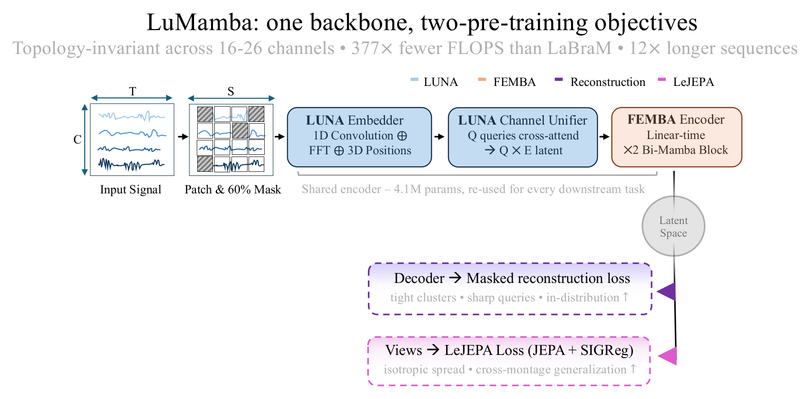
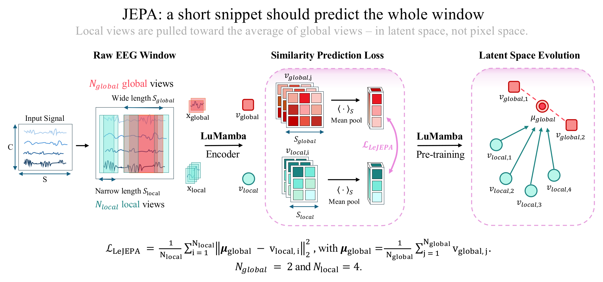
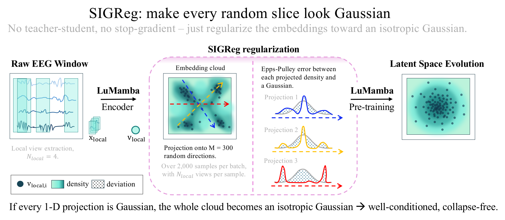
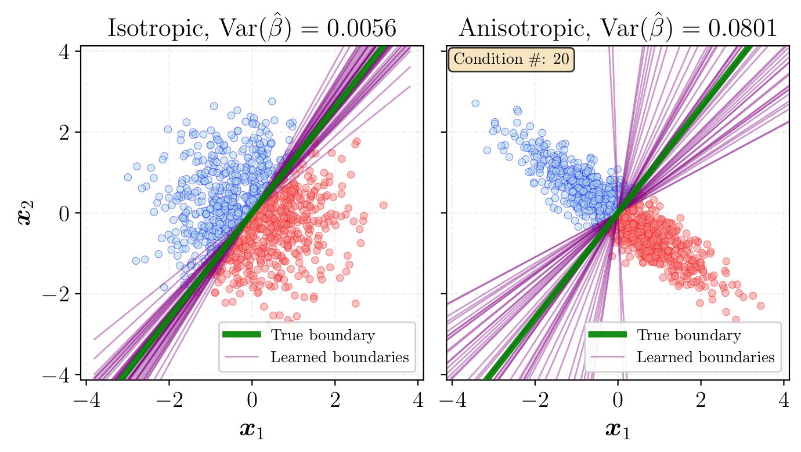

When we build an EEG foundation model, we spend almost all of our design budget on the *architecture*: how to tokenise channels, how to handle variable montages, how to make attention cheap enough to run. We spent a whole [previous post](https://thorirmar.com/post/luna_eeg_foundation_model/) on exactly that. But there is a second decision that gets far less attention and matters just as much: the *objective* you pre-train with. Almost everyone (LaBraM, CBraMod, our own LUNA) reaches for the same one, masked reconstruction, and never looks back. This post is about what happens when you do look back.

With [Danaé Broustail](https://www.linkedin.com/in/dana%C3%A9-broustail-8235aa242/), [Anna Tegon](https://www.linkedin.com/in/anna-tegon-689391306/), [Yawei Li](https://yaweili.bitbucket.io/) and [Luca Benini](https://ee.ethz.ch/the-department/people-a-z/person-detail.luca-benini.html), I recently put out **LuMamba** ([arXiv:2603.19100](https://arxiv.org/abs/2603.19100), *Latent Unified Mamba*). It does two things at once. It fuses LUNA's topology-invariant channel encoding with [FEMBA's](https://arxiv.org/abs/2502.06438) linear-time bidirectional Mamba blocks, giving a 4.6M-parameter model that stays montage-agnostic *and* scales to long sequences. And then, inside that backbone, it runs the first systematic study of **LeJEPA**, a 2025 self-supervised objective, on biosignals, against the usual masked reconstruction. The headline finding is a trade-off, and the practical answer is to mix the two. That is the story I want to walk through here.

## The model in one paragraph

The backbone will be familiar if you read the LUNA post. Raw EEG $x \in \mathbb{R}^{B \times C \times T}$ is segmented into $S = T/P$ temporal patches, and each patch is embedded by fusing a 1-D convolutional time pathway, an FFT-based frequency pathway, and a sinusoidal encoding of the electrode's 3-D scalp coordinate. A **Channel Unification Module** then lets a small set of learned queries cross-attend over the channel axis, collapsing a variable number of electrodes (16 to 26 in our experiments) into a fixed-size latent representation $X_{lat} \in \mathbb{R}^{(B\cdot S) \times Q \times E}$. That is LUNA's trick for being topology-invariant. What is new on the architecture side is the temporal stage. Where LUNA used a transformer over time, LuMamba uses **two bidirectional Mamba blocks** from FEMBA, which model long-range dependencies in linear time. The whole encoder is 4.1M parameters (4.6M including the lightweight fine-tuning head), and it is the part every downstream task reuses. Everything interesting in this post happens at the two arrows leaving the latent on the right of the figure: the pre-training heads.

## Two ways to teach a model with no labels

Self-supervised pre-training needs a pretext task: something the model can be scored on without human labels. There are two very different philosophies, and LuMamba lets us run both through the *same* encoder so the comparison is clean.

The first is **masked reconstruction**, the workhorse of EEG foundation models. Hide a random 60% of the time-domain patches, push the visible ones through the encoder, and ask a small decoder to fill in what was removed. The model is rewarded for reproducing the signal. It is intuitive, it is what we used in LUNA, and as we will see it produces beautifully *structured* representations.

The second is **LeJEPA**, the Latent-Euclidean Joint-Embedding Predictive Architecture, introduced by [Balestriero and LeCun in 2025](https://arxiv.org/abs/2511.08544). LeJEPA never reconstructs anything. It works entirely in latent space and rests on two ideas: a predictive loss that asks parts of a signal to predict the whole, and a regulariser that keeps the embedding distribution well-behaved. Crucially, it does this *without* the teacher–student networks, exponential moving averages, or stop-gradient tricks that earlier joint-embedding methods needed to avoid collapse. It has essentially two knobs. Adapting it to biosignal time series, which had not been done before, is the heart of our contribution, so let me take its two pieces in turn.

## LeJEPA, part 1: predict the whole from the parts

The original JEPA loss was built for images: take crops of a picture, embed them, and make the small crops predict the embedding of the larger ones. We port this idea to the time axis. From each recording we draw $N_{global} = 2$ wide temporal windows of length $T_{global}$ and $N_{local} = 4$ narrow windows of length $T_{local}$, with $T_{global} > T_{local}$. All six views go through the LuMamba encoder. We mean-pool each into an embedding, average the two global embeddings into a target $\boldsymbol{\mu}_{global}$, and then pull every local embedding toward that target:

$$
\mathcal{L}_{\text{JEPA}} = \frac{1}{N_{local}} \sum_{i=1}^{N_{local}} \big\lVert \boldsymbol{\mu}_{global} - v_{local,i} \big\rVert_2^2 , \qquad \boldsymbol{\mu}_{global} = \frac{1}{N_{global}} \sum_{j=1}^{N_{global}} v_{global,j}.
$$

In words: a short snippet of EEG should land, in latent space, where the larger window lands. The model's only job is to agree with itself about *what the signal is* across timescales, a far more abstract target than reproducing a waveform. That abstraction is the source of LeJEPA's appetite for generalisation.

## LeJEPA, part 2: SIGReg, or how to avoid collapse without tricks

A predictive loss alone has an obvious failure mode: the encoder can satisfy it by mapping every view to the same point. Everything agrees, the loss is zero, and the model has learned nothing. This is *representational collapse*, and the elaborate machinery in methods like DINO or BYOL (momentum teachers, stop-gradients) exists mostly to prevent it.

LeJEPA replaces all of that with one clean regulariser: **SIGReg**, Sketched Isotropic Gaussian Regularization. The goal is to make the embedding distribution an *isotropic Gaussian*: spread out evenly in every direction, with no collapsed or degenerate axes.

The "sketched" part is what makes this tractable. Measuring Gaussianity in the full embedding space is hard in high dimensions, so SIGReg instead projects the embeddings onto $M = 300$ random one-dimensional directions and checks, on each shadow, whether the projected values look Gaussian. The check itself is the **Epps–Pulley test**, a normality test that compares the empirical characteristic function of the projected data to that of a Gaussian. The deviation becomes the loss. The logic is a Cramér–Wold-style argument: if *every* one-dimensional projection of a distribution is Gaussian, the distribution itself is an isotropic Gaussian. So enforcing Gaussianity on enough random slices is enough to shape the whole cloud, and collapse, which would show up as a spike in some projection, is penalised automatically. No teacher, no moving average, no stop-gradient. The only real hyperparameters are the regularisation strength $\lambda$ and the number of projection slices $M$.

Why want isotropy at all? The LeJEPA theory gives a sharp answer: among all embedding distributions, an isotropic Gaussian is the one that minimises the worst-case risk of a downstream linear classifier. The intuition is geometric. When the embedding cloud is stretched or partially collapsed (anisotropic), the linear boundaries that separate two classes equally well form a wide, unstable set: nudge the classifier a little and the predictions swing, because the margin is paper-thin along the squashed directions. When the cloud is isotropic, that set of good boundaries is tight and well-conditioned, so the downstream classifier barely cares which particular boundary it lands on. A uniformly-spread space is also exactly what transfers better to electrode montages the model never saw during pre-training.

The two panels above show the same binary problem under both regimes. With isotropic embeddings the learned boundaries pin down tightly around the true one, and the variance of the fitted classifier is an order of magnitude smaller. The anisotropic cloud lets that same boundary swing through a wide fan. That stability is exactly what you want when the downstream task and montage are new.

## The trade-off

Here is the part that surprised us. Reconstruction and LeJEPA differ in more than mechanism: they shape the latent space in *opposite* ways, and neither is strictly better.

Think of the objective as a dial, as in the animation above. Slide it all the way to **reconstruction** and the t-SNE of the learned embeddings shows tight, cleanly-separated clusters, even though pre-training never saw a single label. The query-attention maps over the scalp are sharp and localised, each query camping on a small region. This is a model that has built crisp, specialised structure, and it pays off on in-distribution tasks.

Slide the dial to **LeJEPA** and the picture inverts. The clusters dissolve into one diffuse, near-isotropic blob; the query-attention maps go flat and homogeneous, with little spatial differentiation. By the usual visual standards of representation learning this looks *worse*, and on in-distribution tasks it slightly is. Yet that smooth, well-conditioned geometry is what holds up when you hand the model a montage it has never seen.

The two ends trade off two virtues:

- **Masked reconstruction → structure.** Compact clusters, sharp queries, strong in-distribution performance on the TUH benchmarks.
- **LeJEPA → generalisation.** Isotropic, well-conditioned embeddings that survive distribution shift and unseen electrode layouts, at some cost to peak in-distribution accuracy.

And the practical resolution is the obvious one: **mix them.** A combined LeJEPA-plus-reconstruction objective keeps most of reconstruction's structure while inheriting LeJEPA's robustness. The clearest number: on APAVA, a sparse 16-channel Alzheimer's dataset with a montage absent from pre-training, adding LeJEPA to reconstruction lifts detection AUPR by **over 20%** versus reconstruction alone. The mixed objective is what we use for all the headline benchmarks below.

## Results

LuMamba-Tiny is 4.6M parameters, pre-trained with the mixed objective on roughly **21,600 hours** of unlabelled TUEG recordings from over 14,000 patients, then fine-tuned per task. We evaluated on five datasets chosen to span clinical and non-clinical problems and, deliberately, different montages, all strictly excluded from pre-training.

- **APAVA (Alzheimer's detection, 16 channels).** 0.955 AUROC / **0.970 AUPR**, roughly **+4% AUPR** over the previous state of the art. This is the unseen-montage case where the LeJEPA component earns its keep.
- **TDBrain (Parkinson's detection, 26 channels).** 0.961 AUROC / 0.960 AUPR, on par with Medformer and just behind the much more task-specific BioMamba.
- **TUAB (abnormality detection).** 80.99% balanced accuracy, 0.8825 AUROC, competitive with LaBraM and our own LUNA at a fraction of the size.
- **TUAR / TUSL (artifact and slowing).** Here LuMamba trails task-specific methods, most visibly on the highly class-imbalanced TUSL. This follows from a pre-training recipe built for generalisation across tasks, which costs some peak accuracy on any single in-distribution one. It is exactly the trade-off the dial describes.

The pattern is consistent with the story: the mixed objective wins where robustness to unseen montages matters most, and gives up a little on the in-distribution tasks where pure reconstruction's sharp structure would have squeezed out the last point or two.

## Why it is also cheap

None of this would matter much if the model were expensive to run, and the reason we could afford to study objectives at all is the bi-Mamba backbone. Because Mamba's cost grows only linearly with sequence length, LuMamba stays dramatically lighter than the quadratic-cost attention models at equal sequence lengths: about **26× fewer FLOPs than LUNA**, **377× fewer than LaBraM**, and over **3700× fewer than EEGFormer**. The same linearity lets it ingest much longer windows before hitting GPU memory limits: **12× longer than LUNA** and **501× longer than LaBraM**. For a group whose end goal is running biosignal models on milliwatt-scale wearable hardware, that headroom is the whole point.

## Where this is going

LuMamba sits at the confluence of two threads from our group: LUNA's idea that a small set of learned queries can absorb any electrode layout, and FEMBA's idea that a bidirectional state-space model can replace temporal attention without losing accuracy. What is new here is treating the *objective* as a first-class design choice, and finding that for biosignals, where labels are scarce and montages are heterogeneous, a touch of LeJEPA-style isotropy buys robustness in the EEG embedding space. The balance is not settled, though: on much denser montages the finer-grained topology that pure reconstruction captures can still win out, so there is a sparsity trade-off still to map. The next steps push toward even tinier, recursive models that could eventually run an EEG foundation model on a microcontroller; if the reconstruction-versus-LeJEPA balance is interesting to you, I would love to compare notes.

The paper and code are open:

- 📄 [Paper on arXiv](https://arxiv.org/abs/2603.19100)
- 💻 [BioFoundation GitHub repository](https://github.com/pulp-bio/biofoundation): PyTorch Lightning, Hydra configs, and the LuMamba pre-training recipes.

The dial animation at the top was made with [manim](https://github.com/3b1b/manim) in the [3Blue1Brown](https://www.3blue1brown.com/) style; the `scene.py` scene file lives next to this post in the repo if you want to fork it.

If you have ideas for where the structure-versus-generalisation balance should go next, please [get in touch](https://thorirmar.com/#contact). I am looking for students and collaborators on this line of work.
