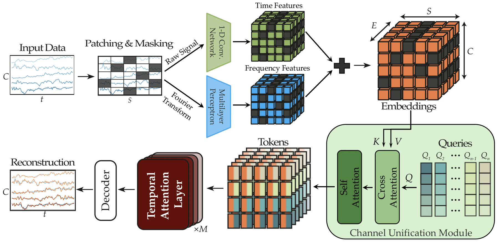
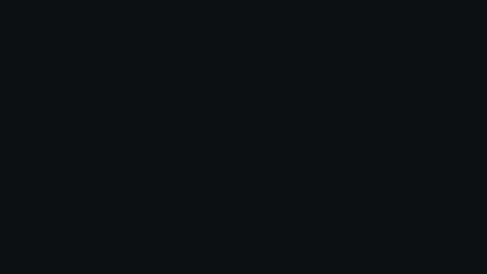

If you have ever tried to train a single model across multiple EEG datasets, you have probably hit the same wall I did. Every dataset uses a different electrode layout. TUEG records up to 24 channels in one montage, Siena uses another, BCI Competition data uses something else again, and consumer wearables shrink to four or eight channels. A standard transformer that treats each channel as a token simply does not transfer between these layouts. Its self-attention cost is quadratic in the number of channels, and the model implicitly memorises the channel order. Swap two electrodes and the representation moves.

[Berkay Döner](https://www.linkedin.com/in/berkaydoner/), [Yawei Li](https://yaweili.bitbucket.io/), [Luca Benini](https://ee.ethz.ch/the-department/people-a-z/person-detail.luca-benini.html) and I [recently published **LUNA** at NeurIPS 2025](https://arxiv.org/abs/2510.22257) (Latent Unified Network Architecture). The goal of this post is to walk through the architecture in enough detail that you could implement it yourself, and to explain why a small set of *learned queries* that cross-attend to the channels gets you a 300× FLOP reduction at the same time as topology-agnostic generalisation.

## The pipeline at a glance

The figure above is the whole encoder and decoder, drawn in the order data flows through it. Multi-channel EEG comes in on the left as a $C \times T$ tensor (channels by time). The signal is patched along time, randomly masked, and embedded by two parallel pathways, one for time-domain features and one for frequency-domain features, which are summed into a unified embedding tensor. Each electrode's 3D coordinate is sinusoidally encoded and added in. Then comes the **Channel Unification Module** on the right, where a fixed set of learned queries cross-attends to those embeddings, collapsing the variable channel axis into a fixed-size latent. The latent goes through $M$ temporal-attention layers, and a decoder reconstructs the masked patches.

The rest of the post zooms in on each block.

## Patches and the two-pathway embedding

Given raw EEG $x \in \mathbb{R}^{B \times C \times T}$ (a batch of recordings with $C$ channels and $T$ time samples), the encoder first segments each channel into $S = T / P$ non-overlapping temporal patches of size $P$. Each patch is a short window of one channel's signal, and a random subset of patches is masked out for the self-supervised reconstruction task.

LUNA processes each patch through *two* parallel pathways before fusing them.

The **time pathway** runs the raw patch through a small 1-D convolutional network (with GroupNorm and GELU). It captures sharp transients, short-time morphology, and other local temporal features. This is the same trick used by LaBraM and CBraMod.

The **frequency pathway** runs each patch through an FFT, then projects the magnitude and phase through a small MLP. This gives the model an explicit handle on rhythmic structure (alpha, beta, gamma) without relying on the time-domain network to learn it from scratch.

The two pathway outputs are summed into a per-patch embedding of dimension $E$. After this stage we have a tensor of shape $(B, C, S, E)$: Batch, Channels, time-Patches, Embedding-dim. The awkward axis is $C$, and the rest of the architecture exists to deal with it.

## Encoding electrode positions: NeRF-style sinusoidal PE

A 24-channel TUEG recording and a 4-channel headband cover very different parts of the scalp. If the model is going to share a backbone across them, it has to know *where* each channel was recorded, not just what its waveform looks like.

LUNA borrows a trick from neural radiance fields. Each electrode has a normalised 3D coordinate $(x_i, y_i, z_i)$ on the head. We pass that coordinate through a sinusoidal positional encoding,

$$
\gamma(\mathbf{p}) = \big[\sin(2^0\pi \mathbf{p}),\, \cos(2^0\pi \mathbf{p}),\, \dots,\, \sin(2^{L-1}\pi \mathbf{p}),\, \cos(2^{L-1}\pi \mathbf{p})\big],
$$

then through a small MLP, and add the result to that channel's embedding. Now every patch token carries both *what* was recorded and *where* on the scalp it was recorded. Swapping two electrodes simply re-labels which spatial codes attach to which channels, and the model has no implicit channel ordering to memorise.

## The Channel Unification Module

In a vanilla EEG transformer, each electrode produces a token, and self-attention runs over all $C \times S$ of them at cost $O((CS)^2)$. LUNA replaces this with a much smaller, *learned* set of latent queries, $Q \in \mathbb{R}^{N \times E}$, where $N \ll C$ is fixed and chosen ahead of time (we use $N = 8$). For each time patch, those $N$ latents **cross-attend** to whatever electrodes happen to be present:

$$
\mathrm{Tokens} = \mathrm{CrossAttention}(Q,\, K(X),\, V(X))
$$

The keys and values come from the input channel embeddings; the queries do not. So when the input has 24 channels you compute attention over 24 keys, and when it has 4 channels you compute attention over 4 keys. Either way the output has the same fixed shape $N \times E$. A short stack of self-attention layers inside the CUM then refines those $N$ tokens, and they are the only tokens the rest of the network ever sees.

The queries are model parameters. They are not produced from the input. They are initialised once, learned during pre-training, and reused for every EEG layout the model ever sees. The cross-attention pattern itself goes back to [Perceiver IO](https://arxiv.org/abs/2107.14795) and shows up in DETR's object queries; what is new is making it work for biosignals at scale, with a self-supervised objective that actually transfers across heterogeneous montages.

## Watching the channel axis collapse

The animation below walks through the Channel Unification Module end-to-end. It is rendered in [3Blue1Brown's](https://www.3blue1brown.com/) visual (On a sidenote that animation style is terrificly good!) because the channel-axis story is fundamentally about *shapes that flow*.

1. **Positional encoding.** A small head schematic emits the (xᵢ, yᵢ, zᵢ) tuple. It runs through the sin/cos PE box and is fused into the channel features (the brief lavender shimmer on the channel grid).
2. **Learned queries appear.** The eight queries light up one by one inside the green Channel Unification Module, with a brief "training shimmer" and a callout reminding you they are model parameters, not data.
3. **Cross-attention.** All 24 channels (now carrying spatial info) cross-attend into the queries, producing a fixed-size $N \times d$ token sequence.
4. **Channel-agnostic.** The input shrinks to 4 channels. The cross-attention re-binds, but the queries, and therefore the token output, stay exactly the same shape. Every downstream block sees an identical-shape input.
5. **Specialisation.** After pre-training, each query has learned to attend to a specific brain region. The animation closes by lighting up Q₁'s frontal preference, Q₄'s central focus, and Q₈'s occipital tuning, mirroring the topomap analysis in the [paper](https://arxiv.org/abs/2510.22257).

The animation was rendered with [manim](https://github.com/3b1b/manim); the scene file lives next to this post in the repo if you want to fork the visualisation.

## Why the savings are so large

Two effects compound. First, cross-attention replaces self-attention on the wide axis. If $N \ll C$, you have already turned an $O(C^2)$ cost into $O(NC)$ on the channel side, and the constant factors fall out cleanly because the query side is fixed. Second, all the deep blocks see only $N$ tokens per patch. The expensive layers, like the feed-forwards and the time-axis transformer, never grow with the electrode count. Doubling the montage size only changes the cheap front end.

Against a strong channel-tokenising transformer baseline, LUNA's encoder is roughly **300× cheaper in FLOPs** and uses **about 10× less GPU memory** at inference. That is the gap between "feasible only on a server" and "feasible on the kind of hardware we eventually want to put in a wearable."

## Pre-training: masked reconstruction on 21,000+ hours

The other half of the story is data. We pre-trained LUNA on **more than 21,000 hours** of EEG drawn from TUEG and Siena, using a **masked reconstruction** objective. We hide a random subset of the time-domain patches before they enter the encoder, then ask the decoder to fill them in given the latent token sequence. Because the latents are channel-agnostic, the same checkpoint can later be fine-tuned on datasets it has never seen the montage of. The encoder has learned to extract spatially-aware features at a level of abstraction above any specific electrode layout.

The decoder is deliberately small. In foundation-model terms, we want most of the capacity in the encoder, because that is the part downstream tasks reuse.

## Results across diverse tasks

Once you have the pre-trained encoder, you fine-tune it on the task of interest. We evaluated on four tasks deliberately chosen to span very different problem types and electrode layouts.

* **TUAR (artifact rejection).** **0.921 AUROC**, state of the art at submission time.
* **TUAB (abnormality detection).** Strong AUROC and AUPRC against the LaBraM and CBraMod baselines.
* **TUSL (slowing classification).** Competitive accuracy and AUROC. TUSL uses a different montage from TUEG, which is where the topology-agnostic property pays off the most.
* **SEED-V (emotion recognition).** A non-clinical task on a different montage entirely, showing that the same encoder transfers beyond medical use cases.

All of this from a model that is *much* cheaper to run than a comparable channel-tokenising transformer.

## Where this is going

Biosignal foundation models are not just "vision or NLP models retrained on EEG." The constraints are different. Variable channels, very long sequences, scarce labels, and (in our group's case) the eventual need to deploy on milliwatt-scale hardware. LUNA is one step toward designs that take those constraints seriously from the start.

The same latent-bottleneck idea is showing up in our other work. [FEMBA](https://arxiv.org/abs/2502.06438) replaces the temporal transformer with a bidirectional Mamba block, which scales linearly in sequence length and lets the model see much longer windows than self-attention allows. We have unpublished follow-ups in the pipeline that push further in the direction of *tiny* models, including recursive architectures that share weights across many computational steps, with the goal of running an EEG foundation model on a microcontroller.

The paper and code are open:

* 📄 [Paper on arXiv](https://arxiv.org/abs/2510.22257)
* 💻 [BioFoundation GitHub repository](https://github.com/pulp-bio/biofoundation). PyTorch Lightning, Hydra configs, pre-trained weights, and a fine-tuning README.
* 🔗 [DOI entry](https://doi.org/10.48550/arXiv.2510.22257)
*  🤗 [Hugging Face model card](https://huggingface.co/PulpBio/LUNA)

To use LUNA on a new EEG dataset, the README walks through the fine-tuning flow. If you have ideas for where the latent-compression approach should go next, please [get in touch](/#contact). I am looking for students and collaborators on this line of work.
