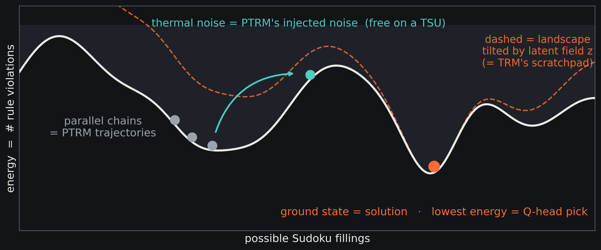
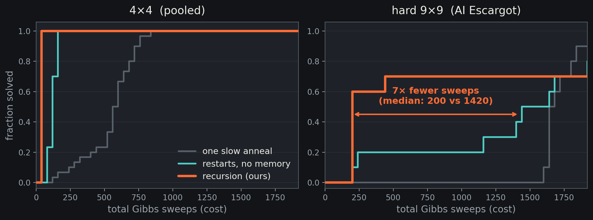
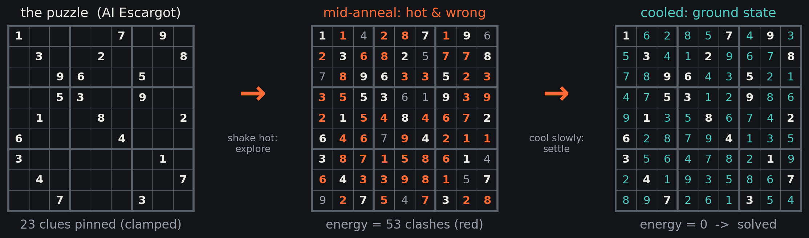

A couple of weeks ago I spent an afternoon at the [Probabilistic Computing Hackathon](https://pc-hackathon.openlesson.academy/) at ETH Zurich, a one-day event run with [Extropic](https://extropic.ai/) around their THRML framework and the broader idea of *thermodynamic computing*. I went in alone, built something I had been turning over in my head for a few days, and it ended up taking second place. This post is the writeup: what I built, why I think the framing is interesting.

Regular readers will know I have a soft spot for *tiny recursive models*. I have [two open thesis projects](/#projects) on them already, and the recurring theme in my work is the same one Extropic cares about from the hardware side: how do you get capable inference without spending frontier-scale energy. So a hackathon about energy-based models and recursive reasoning was almost unfairly on-topic for me.

## The models I started from

The starting point is the [Tiny Recursive Model](https://arxiv.org/abs/2510.04871) (TRM). It is a 7M-parameter network, roughly ten thousand times smaller than a frontier LLM, that solves hard reasoning puzzles by *looping*. Instead of producing an answer in one forward pass, it reads its own draft answer plus a latent scratchpad, refines both, and repeats. With that loop it reaches 45% on ARC-AGI-1 and 87% on Sudoku-Extreme, beating reasoning models orders of magnitude larger. Depth comes from iteration, not from parameter count.

The catch is that the loop is *deterministic*. Run it twice on the same puzzle and you get the same trajectory, which means it can settle into a wrong answer with no way to climb back out. Two recent papers fix exactly this. The [Probabilistic Tiny Recursive Model](https://arxiv.org/abs/2605.19943) (PTRM) injects Gaussian noise into the latent state at every recursion step, runs many noisy rollouts in parallel, and selects the best one using the Q-head that TRM already had for early stopping. No retraining, and Sudoku-Extreme jumps from 87% to almost 99%. [GRAM](https://arxiv.org/abs/2605.19376) (Generative Recursive reAsoning Models) goes further and makes the noise itself learned, with a state-dependent mean that steers and a variance that controls exploration.

Here is the detail that set the whole project off. PTRM's own analysis found that the gains come almost entirely from the *noise injection and parallel exploration*. The clever selection machinery on top of it contributes very little. The active ingredient of this flavour of reasoning is, essentially, thermal exploration: kick the state around, try many paths, keep the best.

## The idea: noise is what thermodynamic hardware is for

If the expensive, valuable part of recursive reasoning is noisy parallel exploration, then it is worth noticing that this is precisely what thermodynamic sampling hardware does *natively*. Extropic's chips are physical samplers: they relax a system of coupled stochastic bits toward low-energy states, with thermal fluctuations built into the substrate rather than computed on top of it. [THRML](https://docs.thrml.ai/) is their JAX library for prototyping these block-Gibbs sampling programs on a GPU today.

So the project, in one sentence: take the algorithmic skeleton of TRM/PTRM/GRAM and rebuild it out of sampling primitives, so the parts that cost real energy on a GPU become free physics on a thermodynamic chip.

To make that concrete I needed a task with a natural energy formulation, and Sudoku is almost made for it. Treat every cell as a categorical variable, give every pair of cells in the same row, column or box an energy penalty when they take the same value, and clamp the clues. A correct solution is then exactly a *zero-energy ground state*. Solving the puzzle becomes sampling from the energy-based model and cooling it down until it settles into that ground state.

|  |
|:--:|
| *Every possible Sudoku filling is a point on a landscape whose height is the number of rule violations. Parallel chains are PTRM's trajectories, thermal noise is its injected noise, the deepest valley is the solution, and tilting the landscape with a bias field plays the role of TRM's latent scratchpad.* |

Once you draw that picture, the translation writes itself. Each piece of the neural algorithm has a thermodynamic counterpart:

| TRM / PTRM / GRAM | Thermo-TRM |
|---|---|
| latent scratchpad *z* | bias field tilting the landscape |
| recursion *z* ← *f(x, y, z)* | outer loop over anneals |
| injected Gaussian noise | thermal noise (free on hardware) |
| parallel trajectories | parallel Gibbs chains |
| Q-head selection | exact energy argmin |
| GRAM's μ steering / σ exploration | neural re-proposal / adaptive temperature |

Nothing here is emulated. Every mechanism maps onto something the sampler does as part of its normal operation.

## Does it actually work

Yes, and the clean way to see *why* it works is an ablation. I ran three strategies under an identical total sampling budget:

* **One long anneal.** Shake the system hard, cool it down slowly once, hope it lands in the right valley.
* **Restarts.** Split the budget into several short anneals from fresh random starts, keep the best. Each is an independent gamble with no memory.
* **Recursion (the actual method).** The same short anneals, but after each one I look at where the most successful chains agreed, write that consensus into the bias field, and tilt the landscape before the next round. The notes accumulate. This is the TRM recursion, with the sampler standing in for the network's refinement step.

The recursion is the only difference between the second and third strategies, so the gap between them isolates exactly what the TRM-style loop buys.

|  |
|:--:|
| *Solve rate against total Gibbs sweeps, ten seeds per cell. On AI Escargot, the hardest known 9x9 Sudoku, the recursion (orange) solves with a median of about 200 sweeps against roughly 1420 for memoryless restarts. Memory between attempts is worth around 7x.* |

On the hardest known Sudoku, the recursive version solves with roughly *seven times fewer sampling sweeps* than memoryless restarts. The remaining solve-rate gap at a fixed budget closes as I add more parallel chains, and chains are precisely the resource that thermodynamic hardware scales cheaply. Here is one real run, cooling from a hot, wrong start into the ground state:

|  |
|:--:|
| *A single run on AI Escargot. Left: the puzzle, 23 clues clamped. Middle: mid-anneal, hot and wrong, 53 constraint clashes shown in red. Right: cooled to zero energy, which is the solution. This is actual solver output, not an illustration.* |

## The result

I gave the outer loop a small head start: a 461K-parameter MLP that looks at the puzzle and proposes an initial tilt for the landscape. The detail I am quietly proud of is that this network is trained on data the *sampler generates for itself*. Anneal an unclued grid and every zero-energy sample it produces is a fresh valid Sudoku board. So the physics manufactures the training set, a tiny network amortizes it, and the physics finishes the job at inference. Seventy-five seconds of CPU training is enough to land the sampler within one or two violations of a solution before the loop even starts.

Then I got access to a GPU for an hour and trained a bigger version of that proposer. It more than doubled its held-out accuracy, from 0.23 to 0.52 on empty cells. And on AI Escargot, the more accurate network was *confidently wrong* on two specific cells. Its field pointed the sampler straight at a near-miss and held it there: the solver stalled at energy two and stayed stuck.

This is where the architecture earned its keep. I had added a simple fallback: if the loop fails to improve for a few steps, drop the learned field for a single step and let pure physics explore unbiased. With that enabled, the same stuck run recovers on every seed I tested. The trace reads `[2, 2, 2, 2, 0]`: stuck, stuck, stuck, stuck, solved. A *more accurate* network failed on this particular puzzle, and the sampler corrected it.

I like this for a reason beyond the demo. Average accuracy protects no single instance. A better model on the benchmark can still be catastrophically wrong on the one problem in front of you, and a system that leans entirely on the learned component has no recourse. Here the thermal exploration is not just the cheap part, it is the safety net. That feels like the right division of labour between a learned prior and a physical sampler.

The obvious next experiment is to run the full Sudoku-Extreme set through this solver and measure accuracy properly, which is hours of compute rather than days. The more interesting question is whether the *real* TRM network, rather than my 461K stand-in, can serve as the proposal distribution, so that a trained recursive reasoner and a thermodynamic sampler split the work between them.

## Where this connects

This sits squarely on the line my other work is already walking. My thesis projects on [tiny recursive models for time-series](/project/trm-timeseries/) and [quantized TRMs for edge deployment](/project/trm-quantized/) are both about getting recursive reasoning to run on a tight energy budget, and the long-term goal in our EEG foundation-model work is inference on milliwatt-scale hardware. Thermodynamic computing is a different road to the same destination: instead of shrinking and quantizing a network until it fits a microcontroller, you let physics do the sampling that the network would otherwise have to compute. I do not think these are competing approaches so much as two ends of the same problem, and it was genuinely useful to spend a day at the hardware end of it.

If any of this is interesting to you, the project is open and there is a short talk:

* 💻 [Thermo-TRM on GitHub](https://github.com/Thoriri/Thermo-TRM). THRML, JAX, the three solvers, the benchmark, and pretrained proposer weights so the results reproduce immediately.
* 📺 [10-minute walkthrough on YouTube](https://youtu.be/yRjew-FUUCU).
* 📄 Background reading: [TRM](https://arxiv.org/abs/2510.04871), [PTRM](https://arxiv.org/abs/2605.19943), [GRAM](https://arxiv.org/abs/2605.19376), and the [THRML docs](https://docs.thrml.ai/).

Thanks to the organizers and to Extropic for a genuinely well-run day. If you are working on thermodynamic computing, recursive reasoning, or the place where they meet, [get in touch](/#contact).
